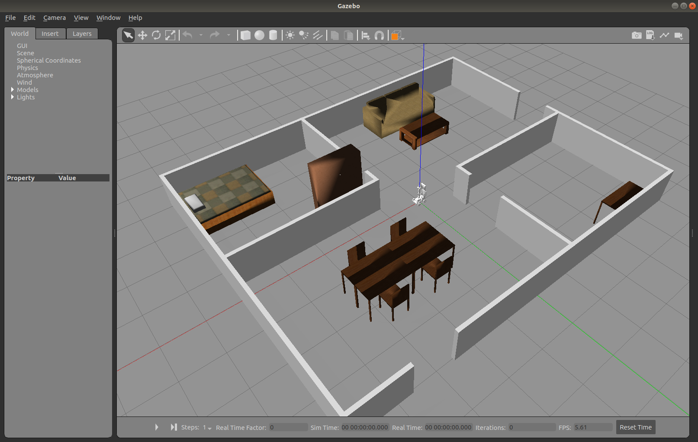
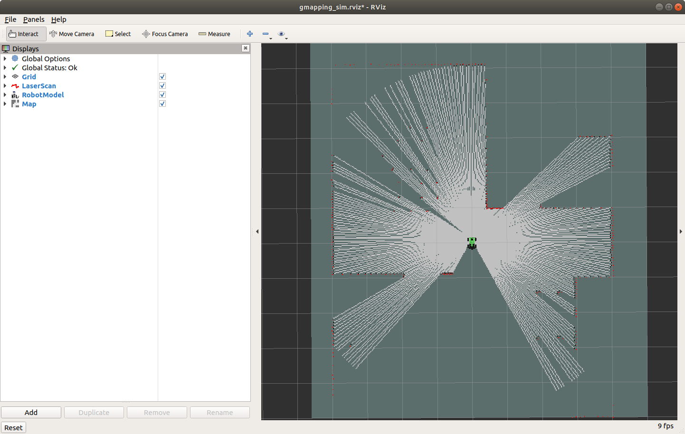

# Lab 6: Simultaneous Localization and Mapping (SLAM)

## Simultaneous Localization and Mapping (SLAM)

Simultaneous localization and mapping (SLAM) is the computational problem of constructing or updating a map of an unknown environment while simultaneously keeping track of an agent's location within it. Popular approximate solution methods include the particle filter, extended Kalman filter, covariance intersection, and GraphSLAM. SLAM algorithms are based on concepts in computational geometry and computer vision, and are used in robot navigation, robotic mapping, and odometry for virtual reality or augmented reality.

SLAM algorithms are tailored to the available resources and are not aimed at perfection but at operational compliance. Published approaches are employed in self-driving cars, unmanned aerial vehicles, autonomous underwater vehicles, planetary rovers, newer domestic robots, and even inside the human body.

## Procedures

### SLAM with JetAuto in Gazebo

Before running SLAM on your robot, we'll use Gazebo and RViz to simulate lidar readings and mapping first.

1. Open a terminal on your Ubuntu 18 computer (not the robot) and run the following:

        roslaunch jetauto_gazebo room_worlds.launch

    This will open up a JetAuto model in a room populated with **furniture**.

    

    ***Figure 6.1** Gazebo Room*

1. Press the **"Play"** button at the **bottom** of the Gazebo simulator to start the simulation.

1. Next, start the SLAM node by opening a new terminal and running the following:

        roslaunch jetauto_slam slam.launch sim:=true

    You can ignore the "No module named 'smbus2'" error because we don't have a joystick connected.

1. Start RViz to visualize the map by opening a new terminal and running the following:

        roslaunch jetauto_slam rviz_slam.launch sim:=true

    !!! info "RViz launch issue"
    
        If RViz does not load with the proper config (not as shown in Fig 6.2), go to **File > Open Config** and open the config file in:

        **~/jetauto_ws/src/jetauto_slam/rviz/without_namespace/gmapping_sim.rviz**

        You can close the default.rviz without saving.

    

    ***Figure 6.2** Gazebo Room Mapping*

1. Start the keyboard controller you used in [Lab 5](lab5.md) and move the robot around to start mapping the entire room. Take note of how the lidar data is showing the walls, furniture, and openings.

1. Once you are satisfied, open a new terminal, navigate to the SLAM map directory, and save the map as `map_01`:

        roscd jetauto_slam/maps

        rosrun map_server map_saver -f map_01 map:=/map

    You should see something similar to this output from the terminal:

        [ INFO] [1729620059.595167203]: Waiting for the map
        [ INFO] [1729620060.388306846]: Received a 1248 X 384 map @ 0.025 m/pix
        [ INFO] [1729620060.388618676]: Writing map occupancy data to map_01.pgm
        [ INFO] [1729620060.400554480, 1407.036000000]: Writing map occupancy data to map_01.yaml
        [ INFO] [1729620060.400909179, 1407.036000000]: Done

    Your map has now been saved as `map_01.pgm`.

1. Close the SLAM and RViz terminals. You can keep the Gazebo room open.

1. With the map saved, we can re-open it by opening a new terminal and running:

        roslaunch jetauto_navigation navigation.launch sim:=true map:=map_01

1. To view the saved map, open a new terminal and run:

        roslaunch jetauto_navigation rviz_navigation.launch sim:=true

    ### SLAM with JetAuto Robot

    !!! info "If connection over NoMachine is slow, you can try to perform SLAM over SSH by following the instructions in the next section."

1. Now, let's try everything out on the physical robot. **Connect** to the JetAuto using NoMachine or any remote **desktop** software and stop the APP service on the robot:

        sudo systemctl stop start_app_node.service

1. Start the SLAM node and use `gmapping` as the mapping method:

        roslaunch jetauto_slam slam.launch slam_methods:=gmapping

1. Open a new terminal and start RViz to visualize the map:

        roslaunch jetauto_slam rviz_slam.launch slam_methods:=gmapping

1. Open a new terminal and start your keyboard controller from [Lab 5](lab5.md) and move the robot around the classroom to map the entire room.

1. Once you are satisfied, open a new terminal, navigate to the SLAM map directory, and save the map as `map_01` on the robot:

        roscd jetauto_slam/maps

        rosrun map_server map_saver -f map_01 map:=/jetauto_1/map

    You should see something similar to this output from the terminal:

        [ INFO] [1729620059.595167203]: Waiting for the map
        [ INFO] [1729620060.388306846]: Received a 1248 X 384 map @ 0.025 m/pix
        [ INFO] [1729620060.388618676]: Writing map occupancy data to map_01.pgm
        [ INFO] [1729620060.400554480, 1407.036000000]: Writing map occupancy data to map_01.yaml
        [ INFO] [1729620060.400909179, 1407.036000000]: Done

    Your map has now been saved.

1. Close the SLAM and RViz terminals.

1. With the map saved, we'll now use it for navigation. Open a new terminal and run:

        roslaunch jetauto_navigation navigation.launch map:=map_01

1. To view the saved map, open a new terminal and run:

        roslaunch jetauto_navigation rviz_navigation.launch

    ### (Advanced) SLAM with JetAuto Robot over SSH

    !!! info "This method has not been fully tested. We will explore it together during the lab session."

    **[Local]** means perform this locally on your laptop.

    **[SSH]** means perform this on the JetAuto Robot over SSH.

    The approach is to run all services required to control the robot's motors and get data from the sensors on the robot using the command line. Any services requiring visualization of data will be processed locally using data published from the robot over the network.

1. **[Local]** Turn off your virtual machine and change the network adapter setting in VirtualBox to "Bridged Adapter". **Settings > Network > Attached to "Bridged Adapter"**. By doing so allow the JetAuto's AP to see your virtual machine as a seperated device and get assigned an IP address instead of hidding behind NAT. Start the virtual machine back up after you changed the settings.

1. **[Local]** ROS can be configured to search for a master node on the network so you can listen and publish to topics from a remote computer. In order to do this, we'll need to know the IP address for both the robot (192.168.149.1) and the IP address assigned to your laptop. Open a terminal and run the following on your computer:

        hostname -I

    You should see an IP address in the range of 192.168.149.XXX. Make a note of this as "your IP". If you see an IP address in the range of 10.XXX.XXX.XXX, you are most likely still connected to the school's network.

1. **[SSH]** Close the SLAM and RViz terminals. SSH into the robot and edit the `~/.bashrc` file to add the ROS master's IP using the nano editor:

        nano ~/.bashrc

    Add the following two lines at the very bottom of `~/.bashrc`.

        export ROS_MASTER_URI=http://192.168.149.1:11311
        export ROS_IP=192.168.149.1

    Save and exit nano, and re-run the terminal startup code.

        source ~/.bashrc

1. **[Local]** On your laptop, edit the local `~/.bashrc` file to add the ROS master's IP using the nano editor:

        nano ~/.bashrc

    Add the following two lines at the very bottom of `~/.bashrc`.

        export ROS_MASTER_URI=http://192.168.149.1:11311
        export ROS_IP=<your IP>

    Save and exit nano, and re-run the terminal startup code.

        source ~/.bashrc

1. **[SSH]** On the robot (in the terminal SSH'd into the robot), stop the App service, then start the SLAM node and use `gmapping` as the mapping method:

        sudo systemctl stop start_app_node.service

        roslaunch jetauto_slam slam.launch slam_methods:=gmapping

    This will start the lidar node to publish the scan data.

1. **[Local]** Open the local terminal you used previously, verify that you are now seeing topics from the ROS master over the network, and start RViz to visualize the map:

        rostopic list

    Verify that you see a list of topics from the ROS master, then run:

        roslaunch jetauto_slam rviz_slam.launch slam_methods:=gmapping

    !!! info "RViz launch issue"
    
        If RViz does not load with the proper config (not as shown in Fig 6.2), go to **File > Open Config** and open the config file in:

        **~/jetauto_ws/src/jetauto_slam/rviz/gmapping_sim.rviz**

        You can close the default.rviz without saving.

1. **[Local]** Open a new terminal and start your keyboard controller from [Lab 5](lab5.md) and move the robot around the classroom to map the entire room.

1. **[SSH]** Once you are satisfied, open a new terminal, SSH into the robot, navigate to the SLAM map directory, and save the map as `map_01` on the robot:

        roscd jetauto_slam/maps

        rosrun map_server map_saver -f map_01 map:=/jetauto_1/map

    You should see something similar to this output from the terminal:

        [ INFO] [1729620059.595167203]: Waiting for the map
        [ INFO] [1729620060.388306846]: Received a 1248 X 384 map @ 0.025 m/pix
        [ INFO] [1729620060.388618676]: Writing map occupancy data to map_01.pgm
        [ INFO] [1729620060.400554480, 1407.036000000]: Writing map occupancy data to map_01.yaml
        [ INFO] [1729620060.400909179, 1407.036000000]: Done

    Your map has now been saved.

1. **[Local]** Close the RViz terminals.

1. **[SSH]** Close the SLAM terminals.

1. **[SSH]** With the map saved, we can now use it for navigation. Open a new terminal, SSH into the robot, and run:

        roslaunch jetauto_navigation navigation.launch map:=map_01

1. **[Local]** To view the saved map, open a new terminal and run:

        roslaunch jetauto_navigation rviz_navigation.launch

## Lab Questions

1. Use SLAM to create and save a map of the **classroom** for [Project 4](project4.md)

## References

- [ROS Tutorials](https://wiki.ros.org/ROS/Tutorials)