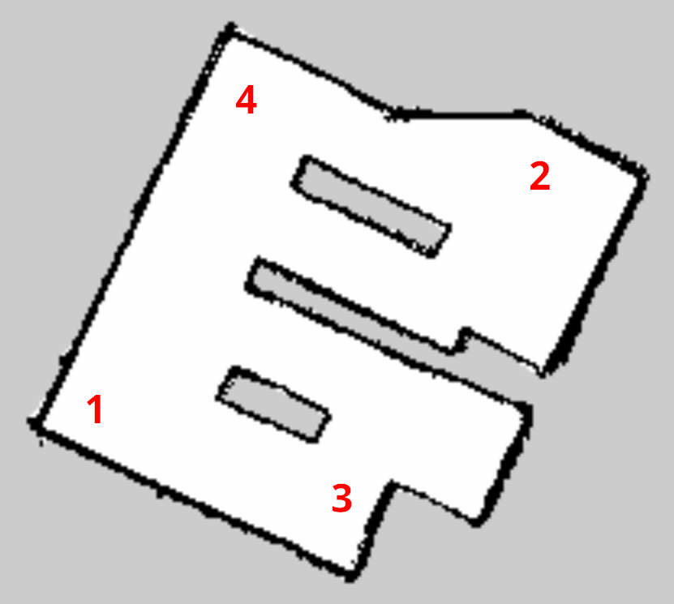

# Lab 7: Navigation

## ROS move_base Navigation Stack

The `move_base` package is the central node of the ROS Navigation Stack, serving as the primary interface for point-to-point autonomous mobile robot navigation. By exposing a ROS action server, it accepts high-level goal poses and orchestrates the complex interaction between a global planner, which calculates the optimal macroscopic path to the destination, and a local planner, which generates the immediate kinematic velocity commands required to follow that path while dynamically avoiding real-time obstacles. To achieve this, it maintains both global and local costmaps that continuously aggregate sensor data to map environmental traversability and keep the robot safe. Furthermore, `move_base` features a robust state machine with built-in recovery behaviors, such as clearing costmaps or executing in-place rotations, allowing the robot to autonomously untangle itself from challenging situations when it becomes temporarily stuck or blocked.

## Procedures

### Navigation using `move_base`

1. In Lab 6, you created a map using the lidar and the gmapping SLAM algorithm. Now, we'll try to use that map for navigation.

1. Download the map of a small room from [here](https://drive.google.com/file/d/1jJzOqjQ_nKUWFbsGKDJoC3sSI2CkMU-8/view?usp=drive_link), then unzip it locally. You should find a `room_map.pgm` and `room_map.yaml`. The `.pgm` file is the actual grid map, and the `.yaml` file provides the specifications for the map file.

1. Copy and paste the map files into the `jetauto_slam/maps` directory on the robot:

    **~/jetauto_ws/src/jetauto_slam/maps/**

    This is the default map directory used by the SLAM and navigation scripts.
    
1. Open a new terminal **on the robot** and run the following.

    Stop the App service:

        sudo systemctl stop start_app_node.service

    Launch the motor controller node:

        roslaunch jetauto_controller jetauto_controller.launch

    Then start the navigation stack with the room map that you copied over:
     
        roslaunch jetauto_navigation navigation.launch map:=room_map

1. To view the map on RViz, open a new terminal and run:

        roslaunch jetauto_navigation rviz_navigation.launch

    You can run RViz from your local computer if you have the ROS network sharing set up. In general, all RViz and robot control commands can be run locally on your computer instead of using the remote desktop if you have the ROS network sharing set up.

1. Once the RViz navigation window is up, you can use the **2D Pose Estimate**, **2D Nav Goal**, and **Publish Point** to manually navigate the robot.

    - **2D Pose Estimate** is used to set the initial position of JetAuto.
    - **2D Nav Goal** is used to set a target point.
    - **Publish Point** is used to set multiple target points.

    Try navigating the robot by providing it an initial pose estimate and setting nav goal.

1. Before moving to the next step, try moving the robot manually using the teleop package (the keyboard controller you created previous from lab 4 or project 3) to see how the robot use its lidar to localize itself in the map. You can also try to move the robot around and see how it reacts to obstacles in the environment. Try to understand how the robot is using the map and its sensors to navigate. You'll notice it take some time for the robot to localize itself.

1. Next, we'll try using a script for navigation instead of manually setting a goal in RViz. Open a new terminal, run `rostopic list`, and find the `/jetauto_1/move_base_simple/goal` topic. If `jetauto_1` is not in the topic path, adjust the publisher path in the code below accordingly.

1. Create a new workspace or use one of your previous workspaces (not `jetauto_ws`) and create a file named `waypoint_navigation.py` in the `scripts` directory of a new or existing package.

    The following will be your starter code for navigation. Once the navigation stack is running from the `navigation.launch` command from a previous step, you can run the following code, and the robot will navigate to waypoint 1 in the room map.

        #!/usr/bin/env python3
        import math
        import rospy
        import numpy as np
        import jetauto_sdk.common as common
        from move_base_msgs.msg import MoveBaseActionResult
        from geometry_msgs.msg import PoseStamped
        from visualization_msgs.msg import Marker, MarkerArray

        # Define your array of waypoints here: (x, y, orientation_in_degrees)
        waypoints = [
            (-0.825, 0.2, 0.0),
        ]

        current_wp_index = 0
        markerArray = MarkerArray()

        def set_current_waypoint():
            global current_wp_index, markerArray

            if current_wp_index >= len(waypoints):
                rospy.loginfo("=====================================================")
                rospy.loginfo("STATUS UPDATE: All waypoints reached!")
                rospy.loginfo("=====================================================")
                return

            target_x, target_y, target_yaw = waypoints[current_wp_index]
            rospy.loginfo(f"STATUS UPDATE: Setting goal for Waypoint {current_wp_index + 1}/{len(waypoints)} -> x: {target_x}, y: {target_y}, yaw: {target_yaw}")

            # Clear previous markers
            marker_Array = MarkerArray()
            marker = Marker()
            marker.header.frame_id = map_frame
            marker.action = Marker.DELETEALL
            marker_Array.markers.append(marker)
            mark_pub.publish(marker_Array)   
            
            # Create Pose
            pose = PoseStamped()
            pose.header.frame_id = map_frame
            pose.header.stamp = rospy.Time.now()
            
            q = common.rpy2qua(0.0, 0.0, math.radians(target_yaw))
            pose.pose.position.x = target_x
            pose.pose.position.y = target_y
            pose.pose.orientation = q

            # Set up the visual marker (flag) in RViz
            marker = Marker()
            marker.header.frame_id = map_frame
            marker.type = marker.MESH_RESOURCE
            marker.mesh_resource = "package://rviz_plugin/media/flag.dae"
            marker.action = marker.ADD
            marker.scale.x = 0.08
            marker.scale.y = 0.08
            marker.scale.z = 0.2
            
            # Randomize marker color
            color = list(np.random.choice(range(256), size=3))
            marker.color.a = 1
            marker.color.r = color[0] / 255.0
            marker.color.g = color[1] / 255.0
            marker.color.b = color[2] / 255.0
            
            marker.pose.position.x = pose.pose.position.x
            marker.pose.position.y = pose.pose.position.y
            marker.pose.orientation = pose.pose.orientation
            
            markerArray.markers.clear()
            markerArray.markers.append(marker)

            # Publish marker and navigation goal
            mark_pub.publish(markerArray)
            goal_pub.publish(pose)
            rospy.loginfo(f"STATUS UPDATE: Robot is now moving to Waypoint {current_wp_index + 1}...")

        def status_callback(msg):
            global current_wp_index
            
            status = msg.status.status
            
            # Status 3 means the goal was reached successfully
            if status == 3:
                rospy.loginfo(f'STATUS UPDATE: Waypoint {current_wp_index + 1} reached successfully.')
                current_wp_index += 1
                
                if current_wp_index < len(waypoints):
                    rospy.loginfo("STATUS UPDATE: Preparing for the next waypoint in 2 seconds...")
                    rospy.sleep(2.0)
                    set_current_waypoint()
                else:
                    set_current_waypoint() # This will trigger the "Navigation complete" block
                    
            # Handle failure states
            elif status == 4:
                rospy.logwarn(f'STATUS UPDATE: Waypoint {current_wp_index + 1} was aborted by move_base. Stopping sequence.')
            elif status == 5:
                rospy.logwarn(f'STATUS UPDATE: Waypoint {current_wp_index + 1} was rejected by move_base. Stopping sequence.')
            elif status == 9:
                rospy.logwarn(f'STATUS UPDATE: Waypoint {current_wp_index + 1} was lost. Stopping sequence.')

        if __name__ == '__main__':
            rospy.init_node('key_start_waypoint_nav', anonymous=True)

            map_frame = rospy.get_param('~map_frame', 'jetauto_1/map')
            move_base_result = rospy.get_param('~move_base_result', '/jetauto_1/move_base/result')

            goal_pub = rospy.Publisher('/jetauto_1/move_base_simple/goal', PoseStamped, queue_size=1)
            mark_pub = rospy.Publisher('jetauto_1/path_point', MarkerArray, queue_size=100)
            
            rospy.Subscriber(move_base_result, MoveBaseActionResult, status_callback)
            
            # Give a brief moment for publishers to register with the ROS Master
            rospy.sleep(0.5)
            
            rospy.loginfo("STATUS UPDATE: Node initialized and ready.")
            
            # Wait for the user to press Enter in the terminal
            input(">>> Press [ENTER] to begin the navigation sequence... <<<")
            
            rospy.loginfo("STATUS UPDATE: Starting waypoint sequence!")
            set_current_waypoint()
            
            try:
                rospy.spin()
            except Exception as e:
                rospy.logerr(str(e))

    If your robot has good localization, it should start navigating to waypoint 1.

    

    ***Figure 7.1** Small Room Map*

1. To add additional waypoints to your script, you'll need to inspect both `room_map.pgm` and `room_map.yaml`. The pixel location in the `.pgm` file needs to be translated to coordinates that ROS can understand using the origin and resolution data from the `.yaml` file. Open the `.pgm` file using an image editing tool such as GIMP and find the x-y pixel coordinates of waypoints 2, 3, and 4. Luckily, once you have found the coordinates of the waypoint, you can ask an AI to calculate the real x-y coordinates with respect to the origin and resolution of the map data.

1. Add the coordinates to your navigation script and see how the robot performs.

1. **The Challenge:** There's a very high chance that the robot will lose its localization. Make adjustments to the script and ask an AI as necessary to increase the reliability of the navigation (without installing any new packages on the robot).

## Lab Tasks and Questions

1. Reliability navigate through all the waypoints of the small room for [Project 5](project5.md).

## References

- [ROS Tutorials](https://wiki.ros.org/ROS/Tutorials)