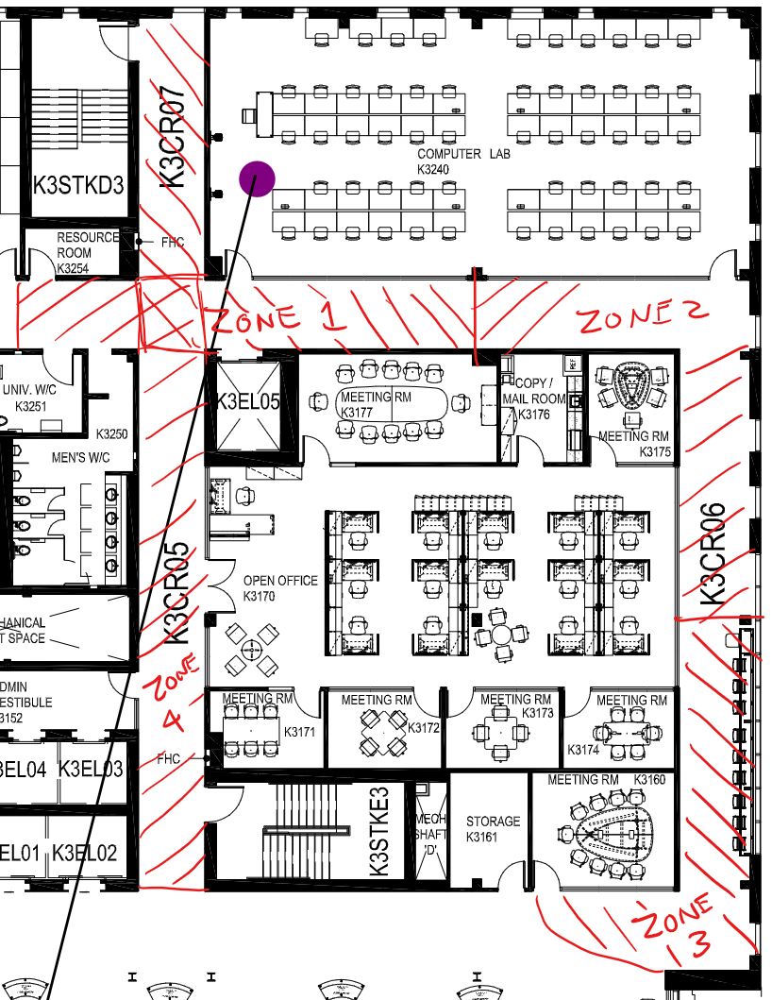

# Project 4 - JetAuto Mapping

**Due:** Sunday, Mar 29, 2026 at 11:59 PM on Blackboard 
**Weight:** 20%

## Introduction

In this project, you will learn the fundamentals of environment mapping for autonomous robots. You will manually operate the robot to map a designated indoor area using ROS mapping packages (SLAM-based tools). The robot will collect LiDAR sensor data while moving through the environment and generate a map of the area. You will then save the generated map and analyze it to ensure that it accurately resembles the area used for mapping.

## Objectives

1. Understand the concept of mapping in autonomous robots.
2. Learn how Simultaneous Localization and Mapping (SLAM) systems build maps of unknown environments.
3. Generate an accurate map of a designated environment.
4. Save the generated map for later use.
5. Interpret occupancy grid maps and understand how robots represent environments.
6. Answer the assessment questions.

**NOTE:** This project must be completed individually.

- [Seneca Academic Integrity Policy](https://www.senecapolytechnic.ca/about/policies/academic-integrity-policy.html)
- [Seneca Generative Artificial Intelligence (GenAI) Policy](https://www.senecapolytechnic.ca/about/policies/generative-ai-policy.html)

### Step 1: Set up the robot and launch the SLAM mapping service

1. In groups of up to 3 students, set up the JetAuto robot.
2. Follow the instructions from [Lab 6](lab6.md) to start the SLAM mapping service.

### Step 2: Teleoperate the JetAuto robot for mapping

1. Follow the instructions from [Lab 6](lab6.md) to teleoperate the robot through a designated area for mapping (assigned Zone by the instructor).

    

    ***Figure P4.1** Hallway Mapping Zone (Ignore the purple dot and the diagonal line)*

2. Ensure the robot covers the entire environment to create a complete map.
3. Monitor the mapping process using RViz.
4. Save the final map once mapping is complete.

### Step 3: Analyze the map

1. Take a screenshot of the generated maps and analyze their quality and identify any potential errors.

## Assessment Questions

1. What is the purpose of mapping in autonomous robots?
2. What type of map representation is commonly used in ROS mapping systems?
3. How does RViz help during the mapping process?
4. What factors can affect the accuracy of the generated map? How do a chair, table, door, and window look in the map?
5. Explain the role of robot sensors in building the map.
6. What files are generated when saving a map, and what is the purpose of each file? (Check the directory manually!)

## Submission

1. The saved map files (map.pgm and map.yaml) from the classroom and from the assigned Zone.
2. A screenshot of the map files identifying any potential errors. A low-quality map with a lot of non-continuous boundaries and missing features will result in a grade reduction. 
3. A short video showing the mapping process in RViz using the real robot (not from a Gazebo simulation).
4. A text file containing the answers to the questions (one per group).

### Late Submission Penalty

1. A 25% reduction from the full mark will be applied for every 24 hours the submission is late after the deadline.