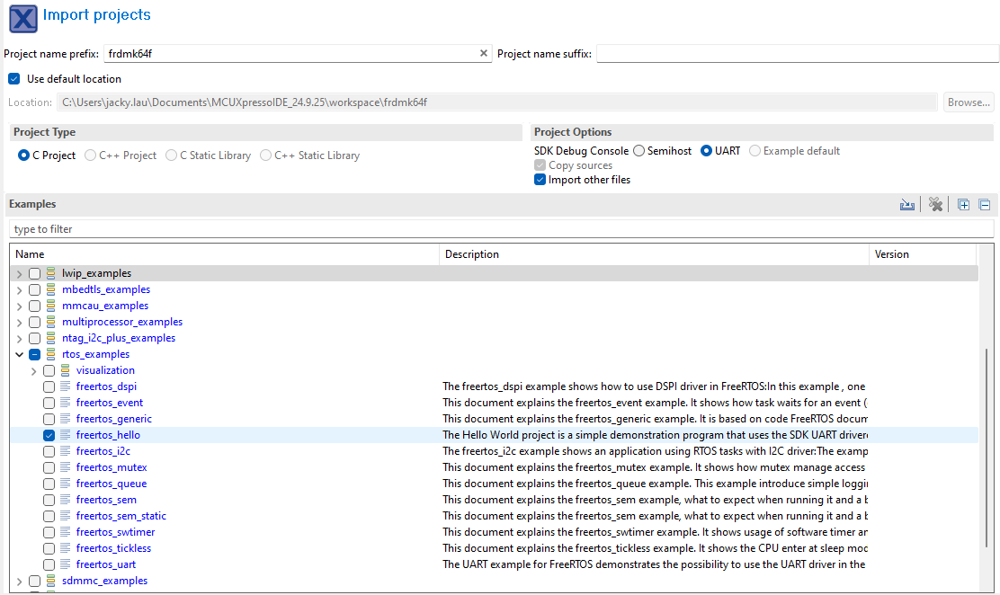

# Lab 1: FreeRTOS and MCUXpresso

## Introduction

This lab introduces the FreeRTOS real-time operating system using the NXP MCUXpresso IDE. You will learn how to create a single task, manage time delays using the OS kernel, and handle basic Input/Output (GPIO and UART) within a task structure.

### Learning Objectives

1.  Import and configure a FreeRTOS project in MCUXpresso.
2.  Understand the anatomy of a FreeRTOS Task (Initialization vs. Infinite Loop).
3.  Use `vTaskDelay()` for non-blocking timing.
4.  Implement GPIO reading and writing within a task.

Documentation of the Cortex-M4 instruction set, board user’s guide, and the microcontroller reference manual can be found here:

- [FRDM-K64F Freedom Module User’s Guide](https://www.nxp.com/webapp/Download?colCode=FRDMK64FUG) ([PDF](FRDMK64FUG.pdf))
- [Kinetis K64 Reference Manual](https://www.nxp.com/webapp/Download?colCode=K64P144M120SF5RM) ([PDF](K64P144M120SF5RM.pdf))
- [FRDM-K66F Freedom Module User’s Guide](https://www.nxp.com/webapp/Download?colCode=FRDMK66FUG) ([PDF](FRDMK66FUG.pdf))
- [Kinetis K66 Reference Manual](https://www.nxp.com/webapp/Download?colCode=K66P144M180SF5RMV2) ([PDF](K66P144M180SF5RMV2.pdf))

Documentation of the Cortex-M4 instruction set can be found here:

- [Arm Cortex-M4 Processor Technical Reference Manual Revision](https://developer.arm.com/documentation/100166/0001) ([PDF](Cortex-M4-Proc-Tech-Ref-Manual.pdf))
    - [Table of Processor Instructions](https://developer.arm.com/documentation/100166/0001/Programmers-Model/Instruction-set-summary/Table-of-processor-instructions)
- [ARMv7-M Architecture Reference Manual](https://developer.arm.com/documentation/ddi0403/latest/) ([PDF](DDI0403E_e_armv7m_arm.pdf))

### FreeRTOS

FreeRTOS is a very popular Real-Time Operating System (RTOS) kernel for microcontrollers. Unlike "bare-metal" programming where your code executes sequentially in a super-loop (`while(1)`), FreeRTOS uses a **Scheduler** to manage multiple independent mini-programs called **Tasks**. The scheduler decides which task runs on the CPU at any given moment based on **Priority**. This allows complex systems to be broken down into smaller, manageable, and deterministic pieces. A key feature you will use today is the **Blocked State**; instead of pausing the CPU with a busy-wait loop (wasting power), FreeRTOS tasks can "sleep" for a precise duration, allowing the CPU to do other work or enter a low-power state.

### Mbed OS (Deprecated)

Mbed OS is another open-source, real-time operating system designed for embedded systems and Internet of Things (IoT) devices. Developed by Arm, it provides a robust platform for building applications that require low power, high performance, and real-time capabilities.

Recently, ARM made the [announcement](https://os.mbed.com/blog/entry/Important-Update-on-Mbed/) regarding the retirement of the Mbed platform and OS. As a result, we'll no longer use Mbed OS as of Winter 2026.

## Materials

- Safety glasses (PPE)
- FRDM-K64F or FRDM-K66F microcontroller board

## Preparation

1.  Read through the lab manual for this lab.
2.  Ensure you have MCUXpresso IDE installed.
3.  Ensure the SDK for your specific board (FRDM-K64F or FRDM-K66F) is installed in MCUXpresso IDE.

## Procedures

### Part 1: FreeRTOS Print

1.  Start by importing a standard FreeRTOS example to ensure the kernel and drivers are configured correctly.

    Open **MCUXpresso IDE** and click **Import SDK example(s)**. Once the **SDK Import Wizard** opens, select your board (`frdmk66f` or `frdmk64f`) and click **Next**.

    Expand the "rtos_examples" category and select "freertos_hello", then click **Finish**.

    Once the project is created, you can rename it to "sep600_lab1" (optional).

    

    ***Figure 1.1:** Create freertos_hello SDK example*

2.  Open `freertos_hello.c` inside the `source` directory. You should find the familiar `BOARD_InitBootPins()`, `BOARD_InitBootClocks()`, and `BOARD_InitDebugConsole()` functions.

    This time, the code includes a `main()` function used primarily for hardware initialization and creating the initial task(s). It ends by starting the scheduler (`vTaskStartScheduler`). The application logic resides in the Task Function (`hello_task()`), which must strictly manage its own loop.

        /*!
        * @brief Application entry point.
        */
        int main(void)
        {
            /* Init board hardware. */
            BOARD_InitBootPins();
            BOARD_InitBootClocks();
            BOARD_InitDebugConsole();
            if (xTaskCreate(hello_task, "Hello_task", configMINIMAL_STACK_SIZE + 100, NULL, hello_task_PRIORITY, NULL) !=
                pdPASS)
            {
                PRINTF("Task creation failed!.\r\n");
                while (1)
                    ;
            }
            vTaskStartScheduler();
            for (;;)
                ;
        }

        /*!
        * @brief Task responsible for printing of "Hello world." message.
        */
        static void hello_task(void *pvParameters)
        {
            for (;;)
            {
                PRINTF("Hello world.\r\n");
                vTaskSuspend(NULL);
            }
        }

3.  Build and Run the code. You should see "Hello World." printed in the serial terminal.

    ### Part 2: FreeRTOS `vTaskDelay()` and Blink

4.  Modify the generic "Hello World" task to control the onboard LED as well. First, open `board.h` to confirm the LED macros (`BOARD_LED_RED_GPIO`, `BOARD_LED_RED_GPIO_PIN`) are defined.

5.  Rename the task `hello_task` to `vTaskFunction` (to align with standard naming conventions), then update the name in the function prototype, the priority definition, and the `xTaskCreate` call in `main()`.

6.  Modify the `vTaskFunction()` task to toggle the red LED and print **SEP600 is Cool!** to the serial output. For the blinking delay, use `vTaskDelay()` along with the `TickType_t` variable type.

        static void vTaskFunction(void *pvParameters)
        {
            // Define a variable for the delay (1000ms)
            const TickType_t xDelay = pdMS_TO_TICKS(1000); 

            /* Task Infinite Loop */
            for (;;) {
                /* Toggle LED */
                LED_RED_TOGGLE();
                
                /* Print to Serial */
                PRINTF("SEP600 is Cool!\r\n");

                /* Block for 1000ms */
                vTaskDelay(xDelay);
            }
        }

7.  Remember, the Red LED pins need to be initialized as a GPIO output before you can use them. You can do this by adding the appropriate initialization code or by using the ConfigTools. However, the "BOARD_InitBUTTONsPins" and "BOARD_InitLEDsPins" functional groups are not defined in this SDK example, so you cannot use the Config Tools Overview Wizard to initialize the pin. You must use the **ConfigTools > Pins** tool instead.

    Open the **ConfigTools > Pins** tool. Once opened, select the appropriate project from the selector at the top. Scroll down to the Pin with the **Identifier** "LED_RED" and enable it as a "GPIO" pin. Once enabled, set the **Direction** to "Output" and the **"GPIO initial state"** to "Logical 1" in the **Routing Details** panel at the bottom.

    Click **Update Code** once you are done.

    

    ***Figure 1.2:** ConfigTools Pins*

    ### Part 3: Code Uploading Methods

8.  Click **Build** to compile the code, but this time, do **NOT** click "Debug".

9.  While the "Debug" tool in MCUXpresso is very useful for uploading and debugging in a single click, let's explore other ways to flash the compiled binary onto the microcontroller board. You can give both options a try.

    1.  **(Option 1)** Click on your code (`freertos_hello.c`), then click on the **GUI Flash Tool** button on the top bar. Follow the prompts to find your board and upload (Run...) the binary `.axf` file.

        

        ***Figure 1.3:** GUI Flash Tool Button*

        

        ***Figure 1.4:** GUI Flash Tool*

    2.  **(Option 2)** Copy and Paste the `.axf` file from the "Debug" directory onto your board drive and wait for it to reset.

10. Your board should start blinking at 1 Hz with the message "SEP600 is Cool!" displaying in the serial terminal. If it's not blinking, you may need to reset your board. One advantage of not using the debug tool is that your code will start immediately without waiting for the "Resume" or "Step Into" command.

    ### Part 4: Serial Terminal Applications

11. To increase the robustness of the project, use a lightweight terminal application from your computer to read the serial port instead of using the built-in serial terminal in MCUXpresso. Here are some options:

    - Windows: [PuTTY](https://www.chiark.greenend.org.uk/~sgtatham/putty/latest.html) or [TeraTerm](https://teratermproject.github.io/index-en.html)
    - Mac/Linux: `screen` or `putty`

12. Stop the serial terminal from MCUXpresso and open the serial port your microcontroller is connected to (e.g., COM4, `/dev/tty.usb...`, or `/dev/ttyACM0`, depending on your platform) at a baud rate of 115200 using PuTTY, screen, or any terminal application of your choice. You should see the following printed:

        SEP600 is Cool!
        SEP600 is Cool!
        SEP600 is Cool!
        ...

    To find which port your microcontroller board is connected to:

    - Windows: Open Device Manager and look under COM Ports, then unplug and re-plug your board to identify the COM port.
    - Mac/Linux: Use `ls /dev/tty*`, then unplug and re-plug your board to find the device port.

    !!! info

        Only one serial terminal can communicate with the microcontroller board. If you want to use PuTTY, stop/close all other serial terminal.

    If you don't see the output, check your code and ensure you are opening the proper port. If the problem persists, be resourceful and troubleshoot the issue.

    Typical settings for PuTTY:

    

    ***Figure 1.5:** Open COM Port with PuTTY*

    !!! info "`screen` terminal for Linux and Mac
    
        Typical command for `screen`:

            screen /dev/ttyXXXXXXXXXXXX 115200

        Replace the above command with the name of your port. To exit the `screen` interface, use `Ctrl + A` then `\`. See the `screen` documentation for details.

    ### Part 5: GenAI-assisted Development Challenge

13. Ask a GenAI agent of your choice to help you add an input logic using `scanf`, `getchar`, or any input function so that the blinking will only start after a serial input or a SW2 or SW3 button press from the user. "SEP600 is Cool!" will only be printed once.

    **Initial Output:**

        Press any key or SW2 or SW3 to start!

    **If a key is pressed:**

        Key pressed!
        SEP600 is Cool!

    **If a button is pressed:**

        Button pressed!
        SEP600 is Cool!

    After the code starts, whenever the button is pressed and held, the LED should blink more rapidly at 5Hz. Once the button is released, the LED return to blink at 1Hz.

    !!! quote "Start with this prompt"
    
        Write a C code snippet for the FRDM-K64F microcontroller board that is running FreeRTOS using MCUXpresso SDK to initialize SW2 and SW3 as inputs and read their state.

    Continue the conversation, improve the prompt, and integrate it into your starter code until the task is achieved.
    
    **Question:** How successful was the GenAI-assisted development? Do you think you can do it faster than GenAI?

Once you've completed all the steps above (and ONLY when you are ready, as you'll only have one opportunity to demo), ask the lab professor or instructor to verify that you've completed the lab. You may be asked to explain some of the concepts you've learned in this lab.

## References

- [vTaskDelay()](https://www.freertos.org/Documentation/02-Kernel/04-API-references/02-Task-control/01-vTaskDelay)
- [GPIO: General Purpose I/O functions](https://mcuxpresso.nxp.com/api_doc/dev/1533/a00022.html)
- This lab manual was generated with the help of Gemini 3 Pro.