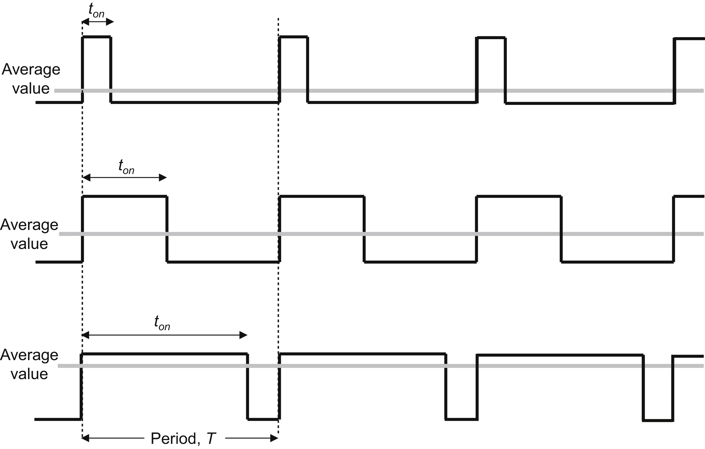
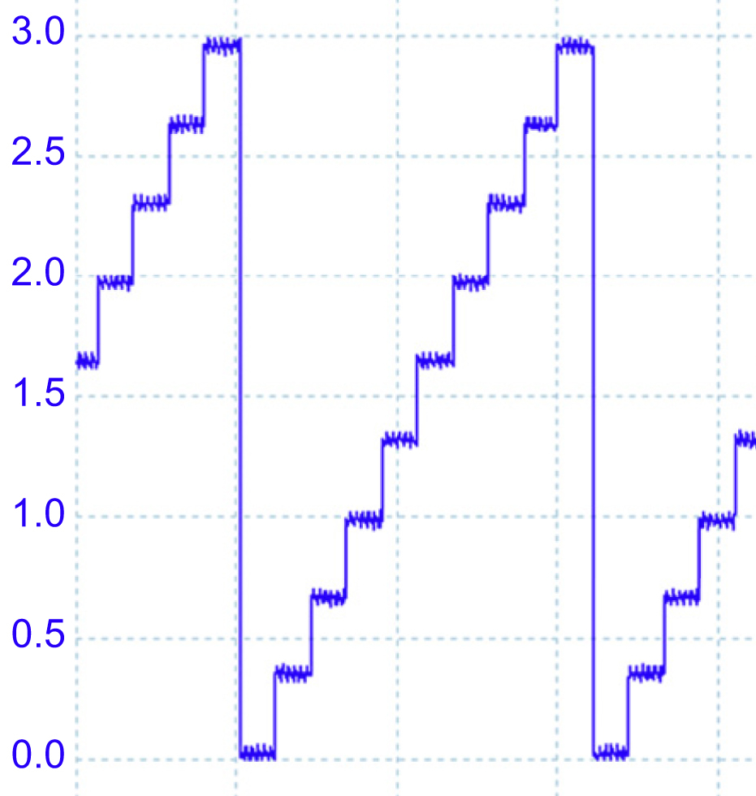
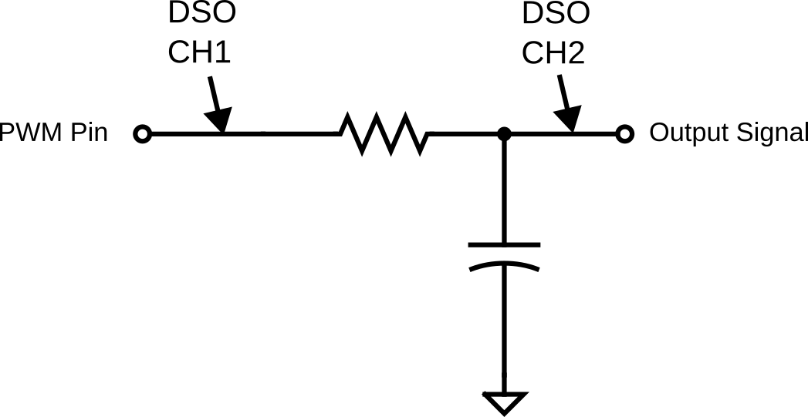
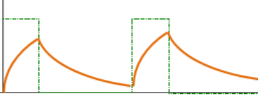
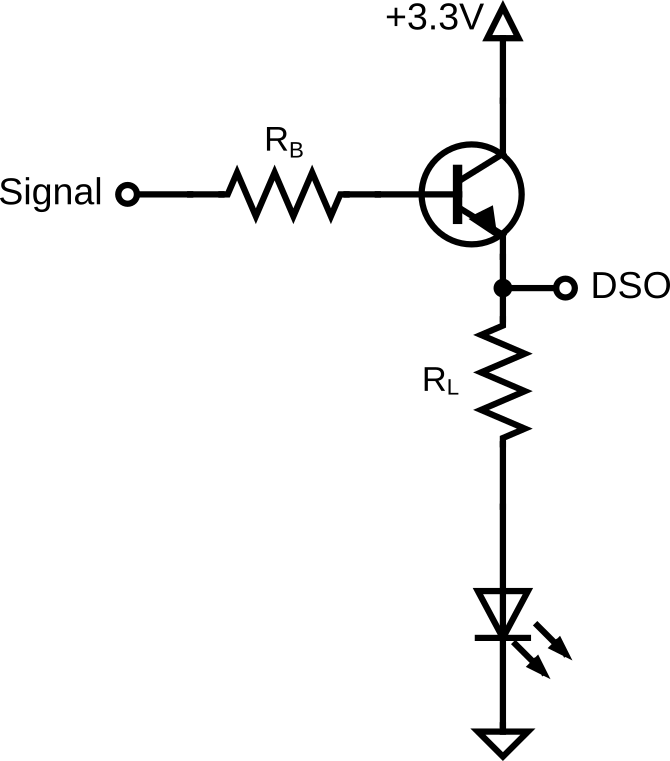
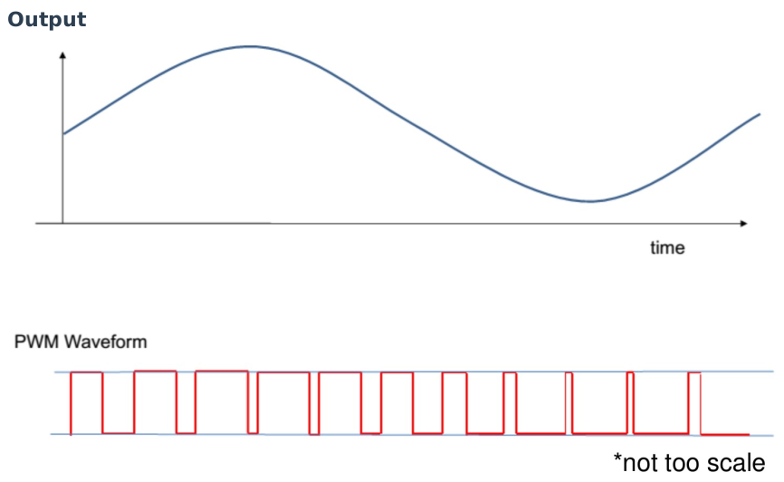

# Lab 3: PWM Smoothing and DAC

## Introduction

This lab focuses on generating analog signals using digital microcontrollers. You will explore two methods: Pulse Width Modulation (PWM) combined with an RC filter, and using a dedicated Digital-to-Analog Converter (DAC). You will implement these using FreeRTOS tasks and the NXP MCUXpresso SDK, leveraging Generative AI to accelerate driver development.

### Learning Objectives

1. Analyze the behavior of RC Low-Pass filters in smoothing PWM signals.
2. Compare the efficiency and signal quality of PWM-based driving vs. DAC-based driving.
3. Implement FlexTimer (FTM) and DAC on the FRDM-K64F or FRDM-K66F.
4. Design FreeRTOS tasks to control analog output over time (fading effects).

Documentation for the Cortex-M4 instruction set, board User’s Guide, and the microcontroller reference manual can be found here:

- [FRDM-K64F Freedom Module User’s Guide](https://www.nxp.com/webapp/Download?colCode=FRDMK64FUG) ([PDF](FRDMK64FUG.pdf))
- [Kinetis K64 Reference Manual](https://www.nxp.com/webapp/Download?colCode=K64P144M120SF5RM) ([PDF](K64P144M120SF5RM.pdf))
- [FRDM-K64F Mbed Reference](https://os.mbed.com/platforms/FRDM-K64F/)
- [FRDM-K64F Mbed Pin Names](https://os.mbed.com/teams/Freescale/wiki/frdm-k64f-pinnames)
- [FRDM-K66F Freedom Module User’s Guide](https://www.nxp.com/webapp/Download?colCode=FRDMK66FUG) ([PDF](FRDMK66FUG.pdf))
- [Kinetis K66 Reference Manual](https://www.nxp.com/webapp/Download?colCode=K66P144M180SF5RMV2) ([PDF](K66P144M180SF5RMV2.pdf))
- [FRDM-K66F Mbed Reference](https://os.mbed.com/platforms/FRDM-K66F/)
- [FRDM-K66F Mbed Pin Names](https://os.mbed.com/teams/NXP/wiki/FRDM-K66F-Pinnames)

Documentation for the Cortex-M4 instruction set can be found here:

- [Arm Cortex-M4 Processor Technical Reference Manual Revision](https://developer.arm.com/documentation/100166/0001) ([PDF](Cortex-M4-Proc-Tech-Ref-Manual.pdf))
    - [Table of Processor Instructions](https://developer.arm.com/documentation/100166/0001/Programmers-Model/Instruction-set-summary/Table-of-processor-instructions)
- [ARMv7-M Architecture Reference Manual](https://developer.arm.com/documentation/ddi0403/latest/) ([PDF](DDI0403E_e_armv7m_arm.pdf))

### Pulse Width Modulation (PWM)

As discussed in class and tested in Lab 2, Pulse Width Modulation (PWM) controls power delivery by varying the width of signal pulses. It involves switching a signal on and off at a high frequency. The "Duty Cycle" is the proportion of time the signal is high.

- High Duty Cycle: More power/voltage delivered.
- Low Duty Cycle: Less power/voltage delivered.

PWM is efficient because the switch is either fully on or fully off, minimizing heat generation compared to linear regulation using a resistive circuit. PWM is widely used in applications such as motor control, light dimming, and power regulation.

***Figure 3.1** PWM*

### Digital-to-Analog Converter (DAC)

A DAC converts digital binary values into a continuous analog voltage. Unlike PWM, which simulates an analog voltage via averaging, a DAC outputs a true physical voltage level. This is crucial for applications like audio playback, where the digital data stored in devices like smartphones or computers must be transformed into analog signals to drive speakers or headphones. The quality of a DAC can significantly influence sound fidelity, as it directly impacts the smoothness and accuracy of the analog signal. DACs are used in a wide variety of devices, from audio equipment and televisions to medical devices and instrumentation, playing a key role in bridging the digital world with the analog one.

***Figure 3.2** DAC Output*

## Materials
- Safety glasses (PPE)
- FRDM-K64F or FRDM-K66F microcontroller board
- Breadboard
- Jumper wires
- Various 1kΩ–10kΩ resistors
- Various 0.1µF–10µF capacitors
- (2x) NPN Transistors (2N2222, 2N3904, or similar)
- (2x) LEDs

## Preparation

1.  Read through the lab manual for this lab.
2.  Ensure you have all the necessary materials for this lab.
3.  Review how to use an Oscilloscope (DSO).

## Procedures

### Part 1: PWM Output as Analog Output

***Figure 3.3** PWM Output with RC Smoothing Circuit.*

1. Assemble the RC circuit shown in Figure 3.3. Connect the input to a PWM-capable pin (refer back to [Lab 2](lab2.md) on how to identify a PWM-capable pin). Check the manual to ensure the pin supports FTM.

    !!! warning "Polarized Capacitor"
    
        If you are using a polarized capacitor, ensure the polarity of your connection is correct (Negative to Ground).

2. Calculate the RC time constant for your circuit, as you will need this for your code later.

    $$\tau = RC$$

3. Start a new C/C++ project in MCUXpresso, and ensure the **Operating System** is set to "FreeRTOS kernel". Also add **dac** and **ftm** under "Drivers" onto the **Components** list. You can name the project "sep600_lab3".

4. You can reuse the code you created from Lab 2 if you didn't use PTC3, or use the code below as an example to generate a PWM signal.

    !!! info "You must use another PWM pin other than PTC3!"

        The following example code generates a PWM signal at PTC3 on a FRDM-K64F board. You must use another PWM-capable pin to demonstrate your understanding of how to create a PWM signal. 

    Add the following header files, macros, and function prototypes into your code:

        #include "FreeRTOS.h"
        #include "task.h"
        #include "fsl_ftm.h"
        #include "fsl_port.h"

        #define BOARD_FTM_BASEADDR FTM0
        #define BOARD_FTM_CHANNEL  kFTM_Chnl_2

        #define vTaskFunction_PRIORITY (configMAX_PRIORITIES - 1)
        static void vTaskFunction(void *pvParameters);
        void InitPWM(void);

    Replace your `main()` function after all the `Board_Init...` calls with the following:

        PRINTF("SEP600 Lab 3 Start\r\n");

        InitPWM();

        if (xTaskCreate(vTaskFunction, "vTaskFunction", configMINIMAL_STACK_SIZE + 100, NULL, vTaskFunction_PRIORITY, NULL) != pdPASS)
        {
            PRINTF("Task creation failed!.\r\n");
            while (1)
                ;
        }
        vTaskStartScheduler();
        for (;;)
            ;
        return 0 ;

    Add the following code under the `main()` function to implement the initialization function:

    void InitPWM(void)
    {
        ftm_config_t ftmInfo;
        ftm_chnl_pwm_signal_param_t ftmParam;

        CLOCK_EnableClock(kCLOCK_PortC);
        CLOCK_EnableClock(kCLOCK_Ftm0);
        PORT_SetPinMux(PORTC, 3U, kPORT_MuxAlt4);

        FTM_GetDefaultConfig(&ftmInfo);
        FTM_Init(BOARD_FTM_BASEADDR, &ftmInfo);

        ftmParam.chnlNumber            = BOARD_FTM_CHANNEL;
        ftmParam.level                 = kFTM_HighTrue;
        ftmParam.dutyCyclePercent      = 50U;
        ftmParam.firstEdgeDelayPercent = 0U;
        ftmParam.enableComplementary   = false;
        ftmParam.enableDeadtime        = false;

        // replace XXXXX with a frequency that produces a period that is half of the RC time constant you calculated
        if (kStatus_Success != FTM_SetupPwm(BOARD_FTM_BASEADDR, &ftmParam, 1U, kFTM_EdgeAlignedPwm, XXXXXU, CLOCK_GetFreq(kCLOCK_BusClk)))
        {
            PRINTF("PWM Setup Failed\r\n");
            return;
        }

        FTM_StartTimer(BOARD_FTM_BASEADDR, kFTM_SystemClock);
    }

    static void vTaskFunction(void *pvParameters)
    {
        bool increasing = true;
        uint8_t dutyCycle = 0;

        for (;;)
        {
            if (increasing) {
                dutyCycle++;
                if (dutyCycle >= 100) increasing = false;
            } else {
                dutyCycle--;
                if (dutyCycle <= 0) increasing = true;
            }

            FTM_UpdatePwmDutycycle(BOARD_FTM_BASEADDR, BOARD_FTM_CHANNEL, kFTM_EdgeAlignedPwm, dutyCycle);
            FTM_SetSoftwareTrigger(BOARD_FTM_BASEADDR, true);

            vTaskDelay(pdMS_TO_TICKS(20));
        }
    }

5. Turn on the DSO and connect CH1 to your PWM output pin before the RC circuit and CH2 to the output signal of the RC circuit, as shown in Figure 3.3. The DSO ground should be common with your circuit ground.

6. **Build, Flash, Run** and observe the waveform. Adjust the DSO so both CH1 and CH2 are visible on the display. Your signal should look similar to the graph below, with a sawtooth pattern that corresponds to the charging and discharging of the capacitor.

    

    ***Figure 3.4** PWM Signal after RC Smoothing.*

7. What you are seeing is a "ripply" DC voltage (or a poorly filtered analog output) on CH2. Adjust your PWM settings (e.g., frequency) and re-run your code to achieve less than 10% voltage ripple (peak-to-peak voltage < 0.33V).

    **Hint:** Think about the charging/discharging and transient response of a capacitor.

8. Find the IP address of your DSO by pressing the **Utility** button > **I/O** > **LAN Settings** and connect to it using the computer at your work station. Take a screenshot of the improved DC ripple and be prepared to show it to the professor at the end of the lab.

    ### Part 2: PWM vs DAC as Current Driver: GenAI-assisted Development Challenge

    Next, you will compare a "Fake" analog signal (PWM) against a "Real" analog signal (DAC) for driving a transistor.

    

    ***Figure 3.5** Current driver circuit*

1. Build **two** copies of the current driver circuit shown in Figure 3.5.

    - Circuit A: Connect a PWM output pin to the input signal of the current driver.
    - Circuit B: Connect a DAC output pin (DACX_OUT from the pin diagram) to the input signal of the current driver.
    
    Connect **CH1** and **CH2** of the DSO to the BJT emitter of the current driver circuits respectively. Use the microcontroller's 3.3V output and GND connection for the current driver circuit.

2.  Select \(R_B\) and \(R_L\) appropriately.

    - \(R_L\) should limit the current passing through the LED to ~20mA.
    - \(R_B\) should allow the NPN transistor to drive at least 20mA of current when it's fully ON at saturation.
    
    Find the datasheet of the NPN transistor you are using and search for the gain value. It is often referred to as \(h_{FE}\) by manufacturers. Use interpolation to estimate the gain as required if the value for your operating condition is not given.
    
    The following formula might be useful for your calculation of \(R_B\).

    $$I_C = \beta I_B$$

    $$V_{Signal} - V_{BE} = I_B R_B$$

3.  Setting up the DAC is simpler than FTM but requires specific buffer configuration. Ask a GenAI agent of your choice to help you write a code snippet that generates an analog output signal using the DAC.

    !!! quote "Start with this prompt"

        Write a C function for the FRDM-K64F running FreeRTOS using the MCUXpresso SDK to initialize DAC0 and include code to output the analog signal at about 1.65V.

4. Continue the conversation with the GenAI and work collaboratively to achieve the following:

    - Create an `InitDAC()` function for initializing the DAC.
    - Maintaining the task loop with a 20ms delay:
        - Increase the PWM duty cycle from 0% to 100% using `FTM_UpdatePwmDutycycle` and the DAC voltage from 0V to 3.3V using `DAC_SetBufferValue` over 500ms.
        - Decrease the PWM duty cycle from 100% to 0% using `FTM_UpdatePwmDutycycle` and the DAC voltage from 3.3V to 0V using `DAC_SetBufferValue` over 500ms.

5. **Build, Flash, Run** and observe the waveform from the DSO. Adjust the time division so you can see at least one full period of the DAC waveform. You should see something similar to the figure below on your DSO, but the PWM will be too fast for the DSO to display the square wave properly.

    

    ***Figure 3.6** DAC and PWM Output*

6. Observe the LED driven by PWM vs the LED driven by DAC. Do they fade linearly? Does one turn on "sooner" than the other? At what PWM duty cycle does the LED brightness noticeably drop? Think about the operation of each method and understand why they don't turn on and off at the same time with the help of GenAI.

7. Ensure you fully understand the concepts of PWM, RC circuit, DAC, and the current driver.

Once you've completed all the steps above (and ONLY when you are ready, as you'll only have one opportunity to demo), ask the lab professor or instructor to come over and demonstrate that you've completed the lab. You may be asked to explain some of the concepts you've learned in this lab.

## References

- [FTM: FlexTimer Driver](https://mcuxpresso.nxp.com/api_doc/dev/1533/a00021.html)
- [DAC: Digital-to-Analog Converter Driver](https://mcuxpresso.nxp.com/api_doc/dev/102/group__dac.html)
- This lab manual was generated with the help of Gemini 3 Pro.