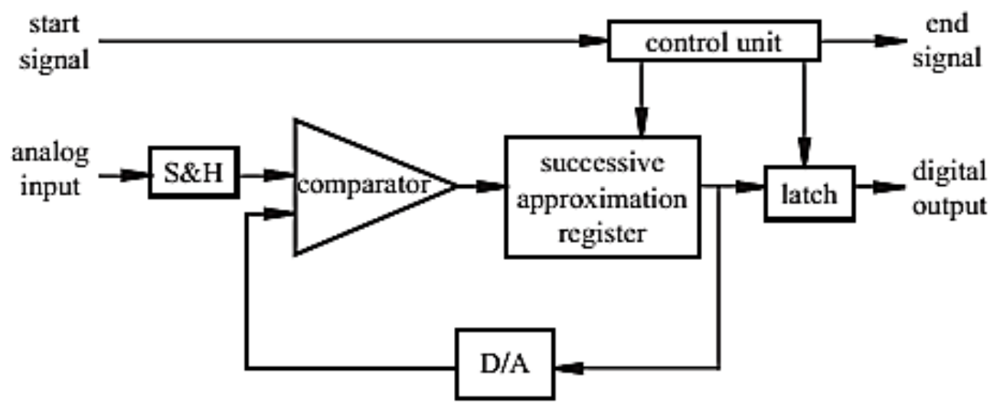
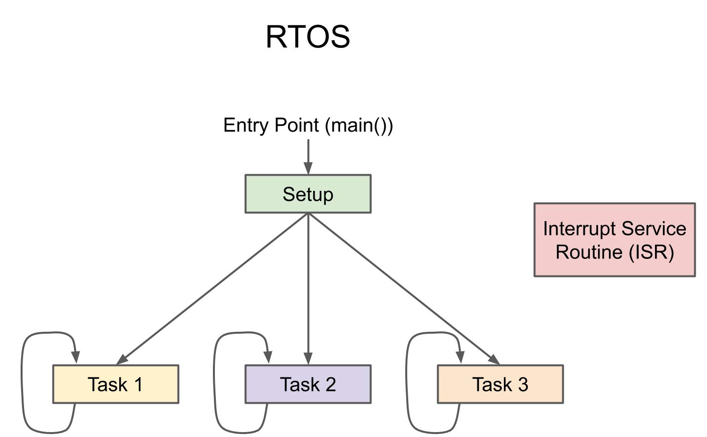
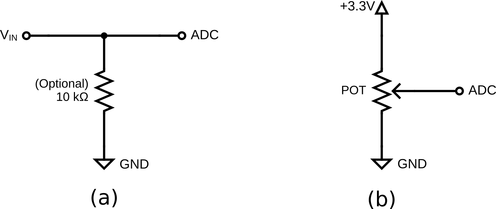

# Lab 4: ADC and RTOS

## Introduction

This lab introduces Analog-to-Digital Conversion (ADC) and explores the capabilities of a Real-Time Operating System (FreeRTOS) on the NXP Kinetis platform. You will learn to read analog sensors and manage multiple concurrent tasks, a fundamental skill set for complex embedded systems.

### Learning Objectives

1. Configure and read from the ADC on the FRDM-K64F or FRDM-K66F.
2. Convert raw ADC values into meaningful voltage levels and percentages.
3. Create and manage multiple FreeRTOS tasks (Analog Reading vs. Serial Logging).
4. Implement Mutexes (Mutual Exclusion) to protect shared resources (like UART) from corruption.

Documentation for the Cortex-M4 instruction set, board user's guide, and the microcontroller reference manual can be found here:

- [FRDM-K64F Freedom Module User’s Guide](https://www.nxp.com/webapp/Download?colCode=FRDMK64FUG) ([PDF](FRDMK64FUG.pdf))
- [Kinetis K64 Reference Manual](https://www.nxp.com/webapp/Download?colCode=K64P144M120SF5RM) ([PDF](K64P144M120SF5RM.pdf))
- [FRDM-K64F Mbed Reference](https://os.mbed.com/platforms/FRDM-K64F/)
- [FRDM-K64F Mbed Pin Names](https://os.mbed.com/teams/Freescale/wiki/frdm-k64f-pinnames)
- [FRDM-K66F Freedom Module User’s Guide](https://www.nxp.com/webapp/Download?colCode=FRDMK66FUG) ([PDF](FRDMK66FUG.pdf))
- [Kinetis K66 Reference Manual](https://www.nxp.com/webapp/Download?colCode=K66P144M180SF5RMV2) ([PDF](K66P144M180SF5RMV2.pdf))
- [FRDM-K66F Mbed Reference](https://os.mbed.com/platforms/FRDM-K66F/)
- [FRDM-K66F Mbed Pin Names](https://os.mbed.com/teams/NXP/wiki/FRDM-K66F-Pinnames)

Documentation for the Cortex-M4 instruction set can be found here:

- [Arm Cortex-M4 Processor Technical Reference Manual Revision](https://developer.arm.com/documentation/100166/0001) ([PDF](Cortex-M4-Proc-Tech-Ref-Manual.pdf))
    - [Table of Processor Instructions](https://developer.arm.com/documentation/100166/0001/Programmers-Model/Instruction-set-summary/Table-of-processor-instructions)
- [ARMv7-M Architecture Reference Manual](https://developer.arm.com/documentation/ddi0403/latest/) ([PDF](DDI0403E_e_armv7m_arm.pdf))

### Analog-to-Digital Converter (ADC)

An ADC is a crucial component in modern electronics that converts continuous analog signals into discrete digital values. This conversion allows electronic systems to process real-world analog signals, such as sound, temperature, or light, which are inherently continuous, by transforming them into a format that digital devices like microcontrollers or computers can understand. ADCs are commonly used in applications like audio processing, signal sampling, sensor interfacing, and communications. The quality and accuracy of an ADC are determined by factors such as its resolution (the number of bits used in the conversion) and its sampling rate (how frequently it captures data).

- **Resolution:** The number of bits used (e.g., 12-bit = 0 to 4095).
- **Reference Voltage \(V_{REF}\):** The maximum voltage measurable (3.3V for FRDM-K64F or FRDM-K66F).

***Figure 4.1** ADC Output*

### Real-Time Operating System (RTOS)

An RTOS is a specialized operating system designed to manage hardware resources and execute tasks within strict timing constraints. Unlike general-purpose operating systems, an RTOS prioritizes real-time performance, ensuring that critical tasks execute within a predictable time frame. It typically uses a scheduler (such as preemptive, cooperative, or hybrid) to manage multiple tasks efficiently, balancing system responsiveness and resource utilization. RTOSs like FreeRTOS, VxWorks, and QNX are widely used in applications such as automotive systems, medical devices, industrial automation, and IoT devices, where deterministic behavior is crucial for reliability and safety. By providing features like task prioritization, inter-task communication, and real-time scheduling, an RTOS enhances the performance and stability of embedded systems, making them suitable for time-sensitive applications.

***Figure 4.2** RTOS Program Flowchart*

## Materials

- Safety glasses (PPE)
- FRDM-K64F or FRDM-K66F microcontroller board
- Breadboard
- Jumper wires
- (1×) 10kΩ Resistor
- (1×) 1kΩ–10kΩ Potentiometer (Optional)

## Preparation

1.  Read through this lab manual.
2.  Ensure you have all the necessary materials for this lab.
3.  Review how to use an Oscilloscope (DSO).

## Procedures

### Part 1: Analog Input

***Figure 4.3** ADC Input Circuit.*

1. Assemble the circuit (a) using the workbench power supply (0-3.3V) as \(V_{IN}\) or circuit (b) using a potentiometer as a voltage divider to generate an output signal. Attach the output signal to an ADC-capable (Analog Input) pin on your microcontroller (pins with an orange Analog In label in the pinout diagram from [Lab 2](lab2.md)). Check the manual to ensure the pin supports ADC. Ensure all devices share a common ground.

    !!! info "Ensure the power supply output is **OFF**"

        If you are using the workbench power supply, ensure the power supply output is **OFF** and set it to less than 3.3V.

    !!! danger "DO NOT exceed 3.3V"
    
        DO NOT set the power supply voltage above 3.3V.

2. Start a new C/C++ project in MCUXpresso, and ensure the **Operating System** is set to "FreeRTOS kernel". Also ensure **adc** is checked under "Drivers" in the **Components** list. You can name the project "sep600_lab4".

3. To use the ADC on the FRDM-K64F or FRDM-K66F, we need to initialize and calibrate it. Use the code below as an example to achieve this.

    !!! info "You must use another ADC pin other than PTB2!"

        The following example code initializes and calibrates the ADC at PTB2 on the FRDM-K64F board. **You must use another ADC pin** to demonstrate your understanding of how to initialize and calibrate an ADC to read an analog signal. 

    Add the following header files, macros, and function prototypes into your code:

        #include "FreeRTOS.h"
        #include "task.h"
        #include "fsl_adc16.h"

        #define DEMO_ADC16_BASE          ADC0
        #define DEMO_ADC16_CHANNEL_GROUP 0U
        #define DEMO_ADC16_USER_CHANNEL  12U // PTB2

        #define vTaskFunction_PRIORITY (configMAX_PRIORITIES - 1)
        static void vTaskFunction(void *pvParameters);
        void InitADC(void);

    Replace the code after all the `Board_Init...` calls into your `main()` function with the following:

        PRINTF("SEP600 Lab 4 Start\r\n");

        InitADC();

        if (xTaskCreate(vTaskFunction, "vTaskFunction", configMINIMAL_STACK_SIZE + 100, NULL, vTaskFunction_PRIORITY, NULL) != pdPASS)
        {
            PRINTF("Task creation failed!\r\n");
            while (1)
                ;
        }
        vTaskStartScheduler();
        for (;;)
            ;
        return 0;

    Add the following code under the `main()` function to implement the initialization function:

        void InitADC(void)
        {
            adc16_config_t adc16ConfigStruct;

            CLOCK_EnableClock(kCLOCK_Adc0);

            ADC16_GetDefaultConfig(&adc16ConfigStruct);
            adc16ConfigStruct.resolution = kADC16_ResolutionSE12Bit;
            ADC16_Init(DEMO_ADC16_BASE, &adc16ConfigStruct);

            ADC16_EnableHardwareTrigger(DEMO_ADC16_BASE, false);
            ADC16_SetHardwareAverage(DEMO_ADC16_BASE, kADC16_HardwareAverageCount32);

            if (kStatus_Success == ADC16_DoAutoCalibration(DEMO_ADC16_BASE))
            {
                PRINTF("ADC Calibration Done.\r\n");
            }
            else
            {
                PRINTF("ADC Calibration Failed.\r\n");
            }
        }

        static void vTaskFunction(void *pvParameters)
        {
            adc16_channel_config_t adc16ChannelConfigStruct;

            adc16ChannelConfigStruct.channelNumber = DEMO_ADC16_USER_CHANNEL;
            adc16ChannelConfigStruct.enableInterruptOnConversionCompleted = false;
        #if defined(FSL_FEATURE_ADC16_HAS_DIFF_MODE) && FSL_FEATURE_ADC16_HAS_DIFF_MODE
            adc16ChannelConfigStruct.enableDifferentialConversion = false;
        #endif

            for (;;)
            {
                ADC16_SetChannelConfig(DEMO_ADC16_BASE, DEMO_ADC16_CHANNEL_GROUP, &adc16ChannelConfigStruct);

                /* Wait for conversion to complete */
                while (0U == (kADC16_ChannelConversionDoneFlag &
                            ADC16_GetChannelStatusFlags(DEMO_ADC16_BASE, DEMO_ADC16_CHANNEL_GROUP)))
                {
                }

                /* Return result */
                uint32_t adc_raw = ADC16_GetChannelConversionValue(DEMO_ADC16_BASE, DEMO_ADC16_CHANNEL_GROUP);

                PRINTF("ADC Value: %d\r\n", adc_raw);

                vTaskDelay(pdMS_TO_TICKS(500));
            }
        }

4. **Build, Flash, Run** your code and open a serial terminal to read the output from your microcontroller. It should start displaying the ADC value.

5. Turn on the power supply and set the output to 1V. If using a potentiometer, set it to a middle position. Your ADC value should now read between 1000-2000.

    !!! danger "DO NOT exceed 3.3V"
    
        DO NOT set the power supply voltage above 3.3V.

6. Modify your code to print the reading as voltage instead of the raw ADC value.

    Calculate the voltage as an integer part and a decimal part to avoid using floating point:

        uint32_t voltage_mv = (adc_raw * 3300) / 4096; // (adc_raw * VREF) / MAX_RES;
        uint32_t vol_int = voltage_mv / 1000;
        uint32_t vol_dec = voltage_mv % 1000;
    
        PRINTF("ADC Value: %d | Voltage: %d.%03d V\r\n", adc_raw, vol_int, vol_dec);

7. **Build, Flash, Run** your code and vary the input voltage to the ADC to verify the readings. You may also compare your ADC reading against a multimeter.

    ### Part 2: RTOS Multi-Threading and Race Conditions : GenAI-assisted Development Challenge

    Now we will simulate a realistic embedded scenario: One task reads data from the ADC (high priority), and another task prints/logs the data (low priority), competing for the UART port.

8. Ask a GenAI agent of your choice to help you divide the current code with a single task into two tasks:

    - `Task_ReadADC`: Reads ADC every 100ms. Updates a global variable `g_adcValue`. Prints "Reading Sensor ..." to UART.
    - `Task_Print`: Reads `g_adcValue` every 500ms. Calculates and prints the existing output "ADC Value: ..." to UART.

    !!! quote "Start with this prompt"

        Write two tasks for the FRDM-K64F running FreeRTOS using the MCUXpresso SDK. Task 1 will read signal from ADC every 100ms, save it to a variable, then display a status message. Task 2 will read the variable from Task 1 every 500ms and print its value to serial.

9. Continue the conversation with the GenAI and work collaboratively to achieve the desired outcome. Observe the possible race condition between the two tasks using the same UART resource. You will likely see garbled text (e.g., "Reading ADC ValueSensor ...") on the serial terminal.

    !!! info "Why is there garbled text?"
    
        The UART is a shared resource. The PRINTF function is not atomic; the scheduler switches tasks in the middle of printing a sentence.

    ### Part 3: Mutex for Thread Safety

    To fix the corruption, we must ensure only one task writes to the UART at a time. We can use a Mutex or Semaphore to protect the shared resource from race conditions.

10. Define a Mutex:

    Include the header file:
    
        #include "semphr.h"

    Declare a global handle:
    
        SemaphoreHandle_t xMutexUART;

    Initialize it in `main()` before the scheduler starts:

        xMutexUART = xSemaphoreCreateMutex();

11. Protect the UART resource by wrapping every `PRINTF` call in both tasks with the mutex "Take" and "Give" commands.

        if (xSemaphoreTake(xMutexUART, portMAX_DELAY) == pdTRUE) {
            PRINTF("ADC Value: ...");
            xSemaphoreGive(xMutexUART);
        }

12. **Build, Flash, Run** your code again. The output should now be perfectly interlaced and readable.

    !!! question "Lab Question"
    
        What is the difference between a Binary Semaphore and a Mutex? Why is a Mutex preferred here? (**Hint**: Research "Priority Inversion" in FreeRTOS).

Once you've completed all the steps above (and ONLY when you are ready, as you'll only have one opportunity to demo), ask the lab professor or instructor to come over and demonstrate that you've completed the lab. You may be asked to explain some of the concepts you've learned in this lab.

## References

- [ADC16: Combinational logic inputs Driver](https://mcuxpresso.nxp.com/api_doc/dev/3628/a00006.html)
- [FreeRTOS: Task Creation](https://www.freertos.org/Documentation/02-Kernel/04-API-references/01-Task-creation/00-TaskHandle)
- [FreeRTOS: Task Control](https://www.freertos.org/Documentation/02-Kernel/04-API-references/02-Task-control/00-Task-control)
- [FreeRTOS: Semaphores](https://www.freertos.org/Documentation/02-Kernel/04-API-references/10-Semaphore-and-Mutexes/00-Semaphores)
- This lab manual was generated with the help of Gemini 3 Pro.