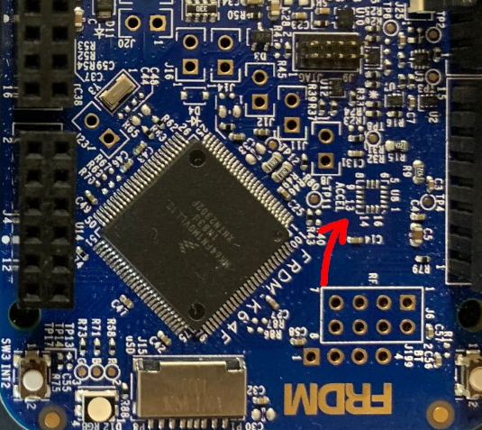
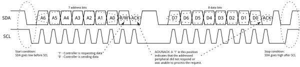

# Lab 5: Serial UART and I2C Communication

## Introduction

This lab explores two of the most common communication protocols in embedded systems: UART (Universal Asynchronous Receiver/Transmitter) and I2C (Inter-Integrated Circuit). You will move away from high-level Mbed libraries and use the MCUXpresso SDK drivers within a FreeRTOS environment. A key focus of this lab is leveraging Generative AI to accelerate the development of peripheral drivers while critically verifying the generated code against hardware specifications.

### Learning Objectives

1.  Understand the working principles of UART and I2C protocols.
2.  Configure and use I2C and UART peripherals using the MCUXpresso SDK.
3.  Implement FreeRTOS tasks to handle asynchronous communication.
4.  Analyze I2C and UART signals using an oscilloscope.

Documentation for the Cortex-M4 instruction set, board user's guide, and the microcontroller reference manual can be found here:

- [FRDM-K64F Freedom Module User’s Guide](https://www.nxp.com/webapp/Download?colCode=FRDMK64FUG) ([PDF](FRDMK64FUG.pdf))
- [Kinetis K64 Reference Manual](https://www.nxp.com/webapp/Download?colCode=K64P144M120SF5RM) ([PDF](K64P144M120SF5RM.pdf))
- [FRDM-K64F Mbed Reference](https://os.mbed.com/platforms/FRDM-K64F/)
- [FRDM-K64F Mbed Pin Names](https://os.mbed.com/teams/Freescale/wiki/frdm-k64f-pinnames)
- [FRDM-K66F Freedom Module User’s Guide](https://www.nxp.com/webapp/Download?colCode=FRDMK66FUG) ([PDF](FRDMK66FUG.pdf))
- [Kinetis K66 Reference Manual](https://www.nxp.com/webapp/Download?colCode=K66P144M180SF5RMV2) ([PDF](K66P144M180SF5RMV2.pdf))
- [FRDM-K66F Mbed Reference](https://os.mbed.com/platforms/FRDM-K66F/)
- [FRDM-K66F Mbed Pin Names](https://os.mbed.com/teams/NXP/wiki/FRDM-K66F-Pinnames)

Documentation for the Cortex-M4 instruction set can be found here:

- [Arm Cortex-M4 Processor Technical Reference Manual Revision](https://developer.arm.com/documentation/100166/0001) ([PDF](Cortex-M4-Proc-Tech-Ref-Manual.pdf))
    - [Table of Processor Instructions](https://developer.arm.com/documentation/100166/0001/Programmers-Model/Instruction-set-summary/Table-of-processor-instructions)
- [ARMv7-M Architecture Reference Manual](https://developer.arm.com/documentation/ddi0403/latest/) ([PDF](DDI0403E_e_armv7m_arm.pdf))

### Serial Universal Asynchronous Receiver/Transmitter (UART)

Serial UART is a communication protocol commonly used for transmitting and receiving data between devices over a serial interface. It operates asynchronously, meaning that data is sent without needing a clock signal, using start bits, data bits, optional parity bits, and stop bits to structure each data frame. UART is widely used in embedded systems, microcontrollers, and computer communication for its simplicity, low cost, and reliability. Devices communicate by converting parallel data into a serial stream for transmission and converting it back on the receiving end. Typical use cases include connecting peripherals like sensors, GPS modules, and Bluetooth devices to a microcontroller or computer. It typically requires only two wires—one for transmitting data (TX) and one for receiving data (RX)—making it efficient for many small-scale applications.

### Inter-Integrated Circuit (I2C)

I2C is a synchronous, multi-master, multi-slave communication protocol commonly used to connect low-speed peripheral devices like sensors, displays, and memory chips to microcontrollers. It uses only two wires for communication: a serial data line (SDA) and a serial clock line (SCL), allowing multiple devices to share the same bus. I2C operates in a master-slave configuration, where the master device controls the clock and initiates communication with the slave devices. Each device on the bus is assigned a unique address, and data is transferred in packets, which include the address and the data to be sent. I2C is favored for its simplicity, ease of use, and ability to connect multiple devices with minimal wiring, making it ideal for embedded systems and applications where space and resources are limited.

## Materials

- Safety glasses (PPE)
- FRDM-K64F or FRDM-K66F microcontroller board
- Breadboard
- Jumper wires
- (2×) 1kΩ Resistors
- I2C MPU6050 Accelerometer Module (Optional)

## Preparation

1.  Read through the lab manual for this lab.
2.  Ensure you have all the necessary materials for this lab.
3.  Review how to use an Oscilloscope (DSO).

## Procedures

### Part 1: Onboard I2C Accelerometer and Magnetometer

In this part you will initialize the I2C peripheral to communicate with the onboard accelerometer (FXOS8700CQ).

!!! warning "Missing Accelerometer on some FRDM-K64F"

    Check to see if the accelerometer is assembled on your board. NXP had a production change in 2023 and no longer assembles the FXOS8700CQ onto the Freedom board. The location **U8** on the Freedom Board should be assembled with the FXOS8700CQ accelerometer chip.

    

    ***Figure 5.1** Freedom Board with missing FXOS8700CQ accelerometer chip*

    **If your board is missing the chip:** You can still verify the I2C signals on the oscilloscope, but the read operation will fail (NACK). Alternatively:
        
    - you may use the FRDM-K64F board from the lab bench **(Do NOT remove the top shield board from the FRDM-K64F)**
    - you may use an external I2C MPU6050 Accelerometer Module and connect it to I2C0 (K64F) or I2C1 (K66F)

!!! warning "No Accessible pin for I2C FXOS8700CQ accelerometer chip on FRDM-K66F"

    The I2C FXOS8700CQ accelerometer chip on the FRDM-K66F does not have an accessible pin on the pin header that we can read from. As a result, you will not be able to complete Part 2 of this lab if you are using a FRDM-K66F with the onboard accelerometer chip. Alternatively:
        
    - you may use the FRDM-K64F board from the lab bench **(Do NOT remove the top shield board from the FRDM-K64F)**
    - you may use an external I2C MPU6050 Accelerometer Module and connect it to I2C0 (K64F) or I2C1 (K66F)

1.  Start a new C/C++ project in MCUXpresso, and ensure the **Operating System** is set to "FreeRTOS kernel". Add the **i2c** driver to your project via **SDK Management > Manage SDK Components**. You can name the project "sep600_lab5".

2.  To use the I2C module connected to the FRDM-K64F or FRDM-K66F, we need to initialize the I2C peripheral and read the `WHO_AM_I` register from the module. Use the code below as an example to achieve this.

    | Accelerometer: | FXOS8700CQ | MPU6050 |
    |---|---|---|
    | **I2C Address (Default):** | 0x1D | 0x68 |
    | **WHO_AM_I Register:** | 0x0D | 0x75 |
    | **Expected Value:** | 0xC7 | 0x68 |
    
    | Recommended I2C Pins: | SCL | SDA |
    |---|---|---|
    | **FRDM-K64F (I2C0):** | PTE24 | PTE25 |
    | **FRDM-K66F (I2C1):** | PTC10 | PTC11 |

    !!! info "Pin for I2C FXOS8700CQ accelerometer chip on FRDM-K66F"

        If you want to access the onboard FXOS8700CQ connected to I2C0 on the FRDM-K66F, change the following code for pins PTD8 (SCL) and PTD9 (SDA).

    Add the following header files, macros, and function prototypes into your code:

        #include "FreeRTOS.h"
        #include "task.h"
        #include "fsl_i2c.h"
        #include "fsl_port.h"

        /*** Update with the correct settings for your board and I2C channel ***/
        #define I2C_BASEADDR          I2C0
        #define I2C_CLK_SRC           I2C0_CLK_SRC
        #define I2C_CLK_FREQ          CLOCK_GetFreq(kCLOCK_BusClk)
        #define I2C_BAUDRATE          100000U   // 100kHz Standard Mode
        #define I2C_RELEASE_SCL_PORT  PORTE
        #define I2C_RELEASE_SCL_GPIO  GPIOE
        #define I2C_RELEASE_SCL_PIN   24U
        #define I2C_RELEASE_SDA_GPIO  GPIOE
        #define I2C_RELEASE_SDA_PORT  PORTE
        #define I2C_RELEASE_SDA_PIN   25U

        /*** Use this for FXOS8700 ***/
        #define FXOS8700_ADDRESS        0x1D    // Default Address
        #define FXOS8700_WHO_AM_I       0x0D    // WHO_AM_I Register
        #define FXOS8700_EXPECTED       0xC7    // Expected Value

        /*** Use this for MPU6050 ***/
        #define MPU6050_ADDRESS         0x68    // Default Address
        #define MPU6050_WHO_AM_I        0x75    // WHO_AM_I Register
        #define MPU6050_EXPECTED        0x68    // Expected Value

        #define vTaskFunction_PRIORITY (configMAX_PRIORITIES - 1)
        static void vTaskFunction(void *pvParameters);
        void InitI2C(void);
        bool I2C_ReadRegister(I2C_Type *base, uint8_t device_addr, uint8_t reg_addr, uint8_t *rxBuff, uint32_t rxSize);
        bool I2C_WriteRegister(I2C_Type *base, uint8_t device_addr, uint8_t reg_addr, uint8_t value);

    Replace the code after all the `Board_Init...` calls into your `main()` function with the following:

        PRINTF("SEP600 Lab 5 Start\r\n");

        InitI2C();

        if (xTaskCreate(vTaskFunction, "vTaskFunction", configMINIMAL_STACK_SIZE + 100, NULL, vTaskFunction_PRIORITY, NULL) != pdPASS)
        {
            PRINTF("Task creation failed!\r\n");
            while (1)
                ;
        }
        vTaskStartScheduler();
        for (;;)
            ;
        return 0;

    Add the following code under the `main()` function to implement the initialization, I2C read, and I2C write functions:

        void InitI2C(void)
        {
            /*** Uncomment this for I2C0 on FRDM-K64F ***/
            //CLOCK_EnableClock(kCLOCK_PortE);
            //
            //port_pin_config_t i2c_pin_config = {
            //    kPORT_PullUp,
            //    kPORT_FastSlewRate,
            //    kPORT_PassiveFilterDisable,
            //    kPORT_OpenDrainEnable,
            //    kPORT_LowDriveStrength,
            //    kPORT_MuxAlt5,              // Alt 5 is I2C0 on K64F
            //    kPORT_UnlockRegister
            //};

            /*** Uncomment this for I2C1 on FRDM-K66F ***/
            //CLOCK_EnableClock(kCLOCK_PortC);
            //
            //port_pin_config_t i2c_pin_config = {
            //    kPORT_PullUp,
            //    kPORT_FastSlewRate,
            //    kPORT_PassiveFilterDisable,
            //    kPORT_OpenDrainEnable,
            //    kPORT_LowDriveStrength,
            //    kPORT_MuxAlt2,              // Alt 2 is I2C1 on K66F
            //    kPORT_UnlockRegister
            //};

            /*** Uncomment this for I2C0 onboard FXOS8700CQ on FRDM-K66F ***/
            //CLOCK_EnableClock(kCLOCK_PortD);
            //
            //port_pin_config_t i2c_pin_config = {
            //    kPORT_PullUp,
            //    kPORT_FastSlewRate,
            //    kPORT_PassiveFilterDisable,
            //    kPORT_OpenDrainEnable,
            //    kPORT_LowDriveStrength,
            //    kPORT_MuxAlt2,              // Alt 2 is I2C1 on K66F
            //    kPORT_UnlockRegister
            //};

            PORT_SetPinConfig(I2C_RELEASE_SCL_PORT, I2C_RELEASE_SCL_PIN, &i2c_pin_config);
            PORT_SetPinConfig(I2C_RELEASE_SCL_PORT, I2C_RELEASE_SDA_PIN, &i2c_pin_config);

            i2c_master_config_t masterConfig;
            I2C_MasterGetDefaultConfig(&masterConfig);
            masterConfig.baudRate_Bps = I2C_BAUDRATE;
            I2C_MasterInit(I2C_BASEADDR, &masterConfig, I2C_CLK_FREQ);
        }

        bool I2C_ReadRegister(I2C_Type *base, uint8_t device_addr, uint8_t reg_addr, uint8_t *rxBuff, uint32_t rxSize)
        {
            i2c_master_transfer_t masterXfer;
            status_t status;

            memset(&masterXfer, 0, sizeof(masterXfer));

            masterXfer.slaveAddress   = device_addr;
            masterXfer.direction      = kI2C_Read;
            masterXfer.subaddress     = reg_addr;
            masterXfer.subaddressSize = 1;
            masterXfer.data           = rxBuff;
            masterXfer.dataSize       = rxSize;
            masterXfer.flags          = kI2C_TransferDefaultFlag;

            status = I2C_MasterTransferBlocking(base, &masterXfer);

            return (status == kStatus_Success);
        }

        bool I2C_WriteRegister(I2C_Type *base, uint8_t device_addr, uint8_t reg_addr, uint8_t value)
        {
            i2c_master_transfer_t masterXfer;
            status_t status;

            memset(&masterXfer, 0, sizeof(masterXfer));

            masterXfer.slaveAddress   = device_addr;
            masterXfer.direction      = kI2C_Write;
            masterXfer.subaddress     = reg_addr;
            masterXfer.subaddressSize = 1;
            masterXfer.data           = &value;
            masterXfer.dataSize       = 1;
            masterXfer.flags          = kI2C_TransferDefaultFlag;

            status = I2C_MasterTransferBlocking(base, &masterXfer);

            return (status == kStatus_Success);
        }

        static void vTaskFunction(void *pvParameters)
        {
            uint8_t who_am_i_value = 0;

            for (;;)
            {
                /*** If you are using MPU6050, change FXOS8700 to MPU6050 ***/
                if (I2C_ReadRegister(I2C_BASEADDR, FXOS8700_ADDRESS, FXOS8700_WHO_AM_I, &who_am_i_value, 1))
                {
                    PRINTF("I2C Success! WHO_AM_I: 0x%X\r\n", who_am_i_value);
                    
                    if (who_am_i_value == FXOS8700_EXPECTED) {
                        PRINTF("FXOS8700 ID Matches!\r\n");
                    }
                }
                else
                {
                    PRINTF("I2C Read Failed.\r\n");
                }

                vTaskDelay(pdMS_TO_TICKS(1000));
            }
        }

4. **Build, Flash, Run** your code and open a serial terminal to read the output from your microcontroller. It should start displaying the response from the WHO_AM_I reply from the I2C device. If your code is correct and the chip is present, you should see `0xC7`. If missing, you might see an error or `0xFF`.

5. Ask a GenAI agent of your choice to help you write code that will read the X, Y, and Z acceleration from the accelerometer and print the reading in "g" (multiple of gravity) with at least 3 decimal places.

    !!! question "Lab Question 1"
    
        What additional register on the accelerometer module do you need to write to in order to achieve this task?

    ### Part 2: Visualize I2C Signal

6.  Power off the board. Connect the oscilloscope probes to the I2C pins used in Part 1 as follows:
    - **CH1:** SDA
    - **CH2:** SCL
    - **Ground:** GND

7.  Power on the board and configure the oscilloscope to use the **"Serial"** option under **"Measure"** on the right of the faceplate to align the I2C signal.

    If the **"Serial"** measurement option is not available or it cannot lock onto the I2C signal, you might need to do this manually by adjusting the trigger level and the edge detection setting.
    
    If you cannot see the I2C signal, decrease the delay in task loop so data are being sent more often and perform a **"Single"** capture of the waveform by pressing the **"Single"** button beside the **"Run"** button.

8.  Observe the data frame. Identify the **Start Bit**, **Address (0x1D)**, **Read/Write Bit**, **ACK/NACK**, and **Stop Bit**. Connect to DSO from the lab computer and take a screenshot of the I2C data frame.

    

    ***Figure 5.2** I2C data frame*

    

    ***Figure 5.3** Successful I2C Write Byte Transmission*

    

    ***Figure 5.4** Successful I2C Read Transmission*

9.  Change your code to write to address `0x1E` instead of `0x1D` and observe the difference in response from the I2C data frame. Take a screenshot of the I2C data frames (both the `0x1D` and  `0x1E` responds).

    !!! question "Lab Question 2"

        When the address is wrong (or if the sensor is missing), what happens during the ACK bit slot after the address is sent? Does the line go Low (ACK) or stay High (NACK)?

    ### Part 3: UART Communication : GenAI-assisted Development Challenge

    In this part, you will establish communication between two microcontroller boards using UART. You will use GenAI to generate the code for sending and receiving data using FreeRTOS tasks.

1.  Verify the **uart** driver to your project via **SDK Management**.

2.  Identify the UART pins for board-to-board communication.

    | Board | UART Instance | TX Pin | RX Pin |
    |---|---|---|---|
    | **FRDM-K64F** | UART3 | PTC17 | PTC16 |
    | **FRDM-K66F** | UART1 | PTC4 | PTC3 |

3.  Ask a GenAI agent of your choice to create two additional FreeRTOS tasks.
    - **Sender Task:** Sends the X, Y, and Z accelerometer data every 500ms via the specified UART.
    - **Receiver Task:** Reads incoming characters from the specified UART and prints them to the debug console (PC).

    !!! quote "Start with this prompt"

        Write a code snippet for FRDM-K64F (or K66F) using MCUXpresso SDK and FreeRTOS.
        1. Initialize UART3 (or UART1) with a baud rate of 9600.
        2. Create a FreeRTOS task "Sender" that sends the X, Y, and Z accelerometer data via UART3 (or UART1) every 500ms.
        3. Create a FreeRTOS task "Receiver" that reads UART3 (or UART1) byte-by-byte and prints it to the debug console.

4.  Do not blindly copy and paste, **verify the following:**
    - Check if the code enables the correct clock (e.g., `kCLOCK_Uart3` and `kCLOCK_PortC`).
    - Check pin muxing (e.g., `kPORT_MuxAlt3` for UART3 on K64F).
    - Ensure the "Receiver" task does not block the entire system. It should ideally use a non-blocking read or a small timeout.

5.  Work with a partner (or use a second board) and connect them as follows:

    - **Board A TX** <--> **Board B RX**
    - **Board A RX** <--> **Board B TX**
    - **GND** <--> **GND**

    !!! warning "Series Resistor"

        It is good practice to place a **1kΩ resistor** in series on the TX/RX lines to protect the pins in case of configuration errors (e.g., two TX pins driving against each other).

6.  **Build, Flash, Run.** Open the serial terminal for both boards. You should see the messages sent by the other board appearing in your terminal. If you don't see messages showing up, troubleshoot the wiring, verify the serial port number, and verify your code by continuing the conversation with the GenAI and work collaboratively to achieve the desired outcome.

    !!! question "Lab Question 3"

        What happens if you disconnect the Ground wire? Why is a common ground required?

Once you've completed all the steps above (and ONLY when you are ready, as you'll only have one opportunity to demo), ask the lab professor or instructor to come over and demonstrate that you've completed the lab. You may be asked to explain some of the concepts you've learned in this lab.

## Reference

- [Analog Device: I2C Primer: What is I2C? (Part 1)](https://www.analog.com/en/resources/technical-articles/i2c-primer-what-is-i2c-part-1.html)
- [I2C: Inter-Integrated Circuit Driver](https://mcuxpresso.nxp.com/api_doc/dev/3628/a00020.html)
- [UART: Universal Asynchronous Receiver/Transmitter Driver](https://mcuxpresso.nxp.com/api_doc/dev/92/group__uart.html)
- This lab manual was generated with the help of Gemini 3 Pro.