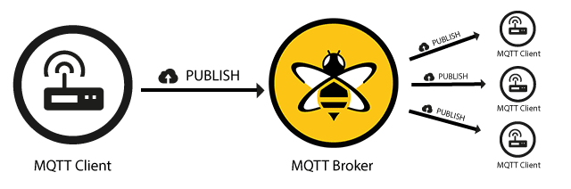

# Lab 6: Interrupts and IoT Messaging using MQTT

## Introduction

This lab introduces hardware interrupts within a FreeRTOS environment and bridges your embedded device to the cloud. You will learn how to handle asynchronous hardware events (like a button press) using deferred interrupt processing. Instead of just turning on an LED, you will send a signal over USB serial to a host computer. A Python script on your computer will act as an IoT edge gateway, publishing that event to a public MQTT broker (HiveMQ), allowing you to view the hardware event live on the web.

### Learning Objectives

1. Configure GPIO interrupts using the NXP MCUXpresso SDK.
2. Implement deferred interrupt processing using FreeRTOS Binary Semaphores to safely hand off work from an ISR to an RTOS Task.
3. Write a Python script using `pyserial` and `paho-mqtt` to bridge local microcontroller UART data to a cloud MQTT broker.
4. Understand the Publish/Subscribe messaging model and verify messages using a cloud websocket client.

Documentation for the Cortex-M4 instruction set, board user's guide, and the microcontroller reference manual can be found here:

- [FRDM-K64F Freedom Module User’s Guide](https://www.nxp.com/webapp/Download?colCode=FRDMK64FUG) ([PDF](FRDMK64FUG.pdf))
- [Kinetis K64 Reference Manual](https://www.nxp.com/webapp/Download?colCode=K64P144M120SF5RM) ([PDF](K64P144M120SF5RM.pdf))
- [FRDM-K64F Mbed Reference](https://os.mbed.com/platforms/FRDM-K64F/)
- [FRDM-K64F Mbed Pin Names](https://os.mbed.com/teams/Freescale/wiki/frdm-k64f-pinnames)
- [FRDM-K66F Freedom Module User’s Guide](https://www.nxp.com/webapp/Download?colCode=FRDMK66FUG) ([PDF](FRDMK66FUG.pdf))
- [Kinetis K66 Reference Manual](https://www.nxp.com/webapp/Download?colCode=K66P144M180SF5RMV2) ([PDF](K66P144M180SF5RMV2.pdf))
- [FRDM-K66F Mbed Reference](https://os.mbed.com/platforms/FRDM-K66F/)
- [FRDM-K66F Mbed Pin Names](https://os.mbed.com/teams/NXP/wiki/FRDM-K66F-Pinnames)

Documentation for the Cortex-M4 instruction set can be found here:

- [Arm Cortex-M4 Processor Technical Reference Manual Revision](https://developer.arm.com/documentation/100166/0001) ([PDF](Cortex-M4-Proc-Tech-Ref-Manual.pdf))
    - [Table of Processor Instructions](https://developer.arm.com/documentation/100166/0001/Programmers-Model/Instruction-set-summary/Table-of-processor-instructions)
- [ARMv7-M Architecture Reference Manual](https://developer.arm.com/documentation/ddi0403/latest/) ([PDF](DDI0403E_e_armv7m_arm.pdf))

## MQTT

Message Queuing Telemetry Transport (MQTT) is a lightweight, publish-subscribe network protocol specifically designed for IoT (Internet of Things) applications and low-bandwidth, high-latency networks. Unlike traditional request-response models (like HTTP), MQTT relies on a central server called a **Broker** to manage and route messages. Devices (Clients) connect to this broker and can either **Publish** data to specific categories known as Topics (e.g., lab6/board1/button), or **Subscribe** to topics to instantly receive any new messages posted there.

This decoupled architecture means the publisher and subscriber never need to know about each other directly—they only need to know the broker and the topic. Because of its extremely small packet overhead and efficient resource usage, MQTT is the perfect protocol for embedded microcontrollers sending quick hardware events to the cloud.

***Figure 6.1** How MQTT PUBLISH works*

## Materials

- Safety glasses (PPE)
- FRDM-K64F or FRDM-K66F microcontroller board
- A Host PC (Windows/Mac/Linux) with Python 3 installed and internet connection

## Preparation

1.  Read through the lab manual for this lab.
2.  Install the required `pyserial` and `paho-mqtt` Python libraries by running:
    
        pip install pyserial paho-mqtt

## Procedures

### Part 1: FreeRTOS Deferred Interrupts

Hardware interrupts allow the MCU to respond to external events instantly without continuously polling. However, in an RTOS, Interrupt Service Routines (ISRs) must be extremely short. You should never call slow functions like `PRINTF()`, `vTaskDelay()`, or heavy processing inside an ISR.

Instead, a technique called **Deferred Interrupt Processing** should be used. In this approach, the ISR simply sets a flag (a Binary Semaphore) and exits immediately. An RTOS Task waiting for that semaphore immediately wakes up and does the heavy lifting.

1.  Start a new C/C++ project in MCUXpresso, and ensure the **Operating System** is set to "FreeRTOS kernel". Add the **fsl_port** and **fsl_gpio** driver to your project via **SDK Management > Manage SDK Components**. You can name the project "sep600_lab6".

2.  The next task is to write code that will trigger an interrupt using SW2 from your FRDM-K64F or FRDM-K66F microcontroller board. Ask a GenAI agent of your choice to help you write the code.

    !!! warning "Use GenAI smartly and understand what it is doing!"
   
        Do NOT just copy and paste code from GenAI! Remember, you still need to understand what GenAI is doing as you might be tested on the content of this lab.

    !!! quote "Start with this prompt"

        Write a C code for MCUXpresso using FreeRTOS on a FRDM-K64F. I want a hardware GPIO interrupt on SW2 triggered on a falling edge. The ISR should use a Binary Semaphore to unblock a FreeRTOS task. The task should print 'SW2 PRESSED\n' to serial terminal and blink the Red LED. Include the SetPinInterruptConfig, the IRQHandler, and the task definition. I also want a task that displays text to the terminal showing that the system is still alive.

3. GenAI might make dangerous mistakes with RTOS interrupts. Verify the generated code on the following:

    - **Did it clear the interrupt flag?** If the ISR does not call `GPIO_PortClearInterruptFlags()`, the MCU will get stuck in an infinite interrupt loop and freeze.
    - **Did it use the FromISR API?** FreeRTOS requires special API calls inside interrupts. It must use `xSemaphoreGiveFromISR()`, not `xSemaphoreGive()`.
    - **Did it yield?** A proper RTOS ISR checks if a higher-priority task was woken up by the semaphore and requests a context switch using `portYIELD_FROM_ISR(xHigherPriorityTaskWoken)`.

    Ensure your code has the following (or similar naming) in the ISR:
    
        int main(void)
        {
            ...
            sw2_semaphore = xSemaphoreCreateBinary();
            ...
        }

        void SW2_GPIOC_IRQHANDLER(void)
        {
            BaseType_t xHigherPriorityTaskWoken = pdFALSE;
            
            GPIO_PortClearInterruptFlags(BOARD_SW2_GPIO, 1U << BOARD_SW2_GPIO_PIN);
            xSemaphoreGiveFromISR(sw2_semaphore, &xHigherPriorityTaskWoken);
            portYIELD_FROM_ISR(xHigherPriorityTaskWoken);
        }

4. **Build, Flash, Run** your code and open a serial terminal. Every time you press SW2, you should see "SW2 PRESSED" appear exactly once per press.

5. As we are transitioning into an environment where GenAI is becoming a tool that helps us write code, we cannot fully trust the code that is provided to us and must always question its validity. Perform the following exercises to simulate faulty code generated by AI and observe the system behaviour. Then try to figure out why the system did not function properly.

    - **Exercise 1:** Comment out the `GPIO_PortClearInterruptFlags()` line in the ISR.
    - **Exercise 2:** Use `xSemaphoreGive(sw2_semaphore)` instead of `xSemaphoreGiveFromISR(sw2_semaphore, &xHigherPriorityTaskWoken)`.
    - **Exercise 3:** Comment out `sw2_semaphore = xSemaphoreCreateBinary()`.
    - **Exercise 4:** Comment out all `vTaskDelay()` if they exist.

    ### Part 2: Python Serial-to-MQTT Bridge

    Now that the MCU is sending data over USB, we want the host computer to listen to that USB Serial port and forward the message to the internet. We will use MQTT to perform this task. 

6. Ask a GenAI agent of your choice to help you write the host computer side Python code.

    !!! quote "Start with this prompt"

        Write a Python 3 script using 'pyserial' and 'paho-mqtt'. The script should continuously read lines from a serial port at 115200 baud. If the string 'SW2 PRESSED' is received, it should publish a JSON payload `{"event": "sw2_press", "status": "active"}` to the MQTT broker 'broker.hivemq.com' on the topic 'sep600/lab6/<your_unique_id>'. Print a confirmation to the console when published.

7.  Once again, verify the generated code:

    - **Did the AI decode the raw bytes correctly?** It should use line.decode('utf-8').strip() before checking if the string matches. If it compares a byte array to a string, it will fail.
    - **Did the script call client.connect("broker.hivemq.com", 1883, 60)?**
    - **Ensure `<your_unique_id>` in the Python script is actually a unique ID** so your code doesn't clash with someone else's code!

8. Save the script as `mqtt_bridge.py` on your computer.

9. Disconnect the serial terminal from MCUXpresso if it's connected, then run the script via your computer's terminal:

        python mqtt_bridge.py

    The script should sit and wait for "SW2 PRESSED" on serial. Press the button on your MCU board and the Python terminal should indicate that it detected the button press and published the message to HiveMQ.

    !!! warning "A serial or COM port can only be used by one application. You must disconnect the port from MCUXpresso before you can connect it with Python."

    ### Part 3: Cloud Verification (HiveMQ Web Client)

    To prove the message actually made it to the cloud, we will use a public web client to subscribe to your specific topic.

10.  Open your web browser and navigate to the HiveMQ public websocket client: [http://www.hivemq.com/demos/websocket-client/](http://www.hivemq.com/demos/websocket-client/)

11. Leave the default connection settings as they are and click "Connect".

12. Under the "Subscriptions" section, click "Add New Topic Subscription".

13. In the "Topic" field, enter the exact topic you used in your Python script (e.g., sep600/lab6/your_unique_id) and click "Subscribe".

14. Press the SW2 button on your microcontroller and see it in action.

    ### Part 4: Additional Exploration

    Now that publishing to MQTT is functional, let's try subscribing.

15. Update your MCU as well as Python scripts to also listen for messages on a topic and flash the green LED when one is received. HiveMQ's public websocket client can also be used to publish messages to a topic for testing.

16. Work with another group to try MCU to MCU communication over MQTT.

Once you've completed all the steps above (and ONLY when you are ready, as you'll only have one opportunity to demo), ask the lab professor or instructor to come over and demonstrate that you've completed the lab. You may be asked to explain some of the concepts you've learned in this lab.

## Reference

- [GPIO Driver](https://mcuxpresso.nxp.com/api_doc/dev/1529/a00237.html)
- [FreeRTOS: Semaphores](https://www.freertos.org/Documentation/02-Kernel/04-API-references/10-Semaphore-and-Mutexes/00-Semaphores)
- [Paho Python Client](https://eclipse.dev/paho/clients/python/)
- [HiveMQ Platform](https://docs.hivemq.com/hivemq/latest/user-guide/index.html)
- This lab manual was generated with the help of Gemini 3 Pro.