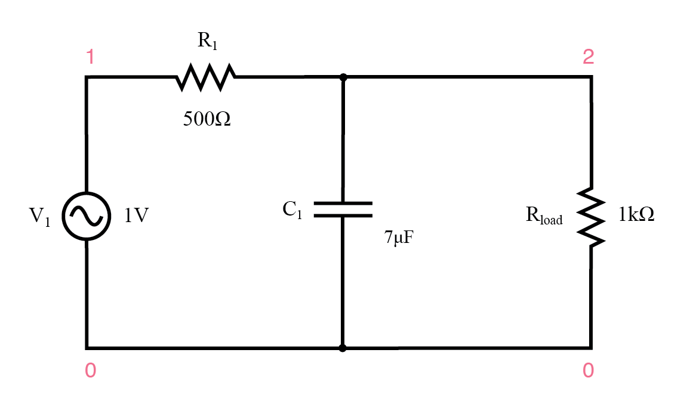
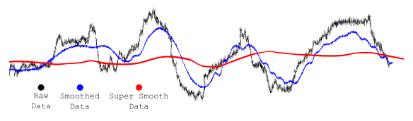
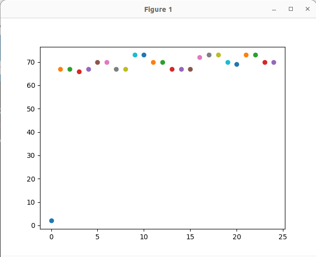

# Lab 7: Software Filtering and RTOS Data Logging

## Introduction

This lab integrates hardware data acquisition and digital signal processing. You will implement a software low-pass filter to remove noise from an analog signal and use FreeRTOS to safely pass this data to a logging task. Finally, you will stream this data over UART to a host computer and visualize it in real-time using Python.

### Learning Objectives

1. Implement an Infinite Impulse Response (IIR) software low-pass filter to clean noisy sensor data.
2. Use FreeRTOS Queues for Inter-Process Communication (IPC) to safely pass data between an ADC reading task and a UART transmitting task.
3. Develop a Python script to read serial data and plot it in real-time using matplotlib.

Documentation for the Cortex-M4 instruction set, board user's guide, and the microcontroller reference manual can be found here:

- [FRDM-K64F Freedom Module User’s Guide](https://www.nxp.com/webapp/Download?colCode=FRDMK64FUG) ([PDF](FRDMK64FUG.pdf))
- [Kinetis K64 Reference Manual](https://www.nxp.com/webapp/Download?colCode=K64P144M120SF5RM) ([PDF](K64P144M120SF5RM.pdf))
- [FRDM-K64F Mbed Reference](https://os.mbed.com/platforms/FRDM-K64F/)
- [FRDM-K64F Mbed Pin Names](https://os.mbed.com/teams/Freescale/wiki/frdm-k64f-pinnames)
- [FRDM-K66F Freedom Module User’s Guide](https://www.nxp.com/webapp/Download?colCode=FRDMK66FUG) ([PDF](FRDMK66FUG.pdf))
- [Kinetis K66 Reference Manual](https://www.nxp.com/webapp/Download?colCode=K66P144M180SF5RMV2) ([PDF](K66P144M180SF5RMV2.pdf))
- [FRDM-K66F Mbed Reference](https://os.mbed.com/platforms/FRDM-K66F/)
- [FRDM-K66F Mbed Pin Names](https://os.mbed.com/teams/NXP/wiki/FRDM-K66F-Pinnames)

Documentation for the Cortex-M4 instruction set can be found here:

- [Arm Cortex-M4 Processor Technical Reference Manual Revision](https://developer.arm.com/documentation/100166/0001) ([PDF](Cortex-M4-Proc-Tech-Ref-Manual.pdf))
    - [Table of Processor Instructions](https://developer.arm.com/documentation/100166/0001/Programmers-Model/Instruction-set-summary/Table-of-processor-instructions)
- [ARMv7-M Architecture Reference Manual](https://developer.arm.com/documentation/ddi0403/latest/) ([PDF](DDI0403E_e_armv7m_arm.pdf))

### Low-Pass Filter

A low-pass filter is an electronic circuit or signal processing technique that allows signals with frequencies below a certain cutoff frequency to pass through, while attenuating or blocking higher-frequency signals. This makes low-pass filters ideal for filtering out high-frequency noise from signals, which is particularly useful in applications like audio processing, communications, and sensor data acquisition. Noise, often caused by electrical interference or other environmental factors, typically manifests as high-frequency components. By using a low-pass filter, these unwanted high-frequency noise signals are reduced, leaving behind the cleaner, more relevant low-frequency signals. The effectiveness of a low-pass filter in noise reduction depends on the cutoff frequency, which must be carefully selected to ensure that the desired signal remains intact while unwanted noise is removed.

***Figure 7.1** Sample Low-Pass Filter*

***Figure 7.2** Signal Filtering*

## Materials
- Safety glasses (PPE)
- FRDM-K64F or FRDM-K66F microcontroller board
- Breadboard
- Jumper Wires
- (1×) Mini Photocell (Light Sensor) (Optional)

## Preparation

1.  Read through the lab manual for this lab.
2.  Install the required `pyserial`, `matplotlib`, and `numpy` Python libraries by running:
    
        pip install pyserial matplotlib numpy

## Procedures

### Part 1: Hardware Setup

1. Start the function generator to output a **1Vpp 1kHz Triangular (Ramp, 50% symmetry)** wave with a **2V DC offset**.

    !!! note "Remember to set the output to high Z mode."
    
    Alternatively, you can read data from a sensor that you are using in your project.

2. Connect the output of the function generator (or Mini Photocell (Light Sensor) in a voltage divider circuit) to an ADC pin on your K64F or K66F board.

    ### Part 2: FreeRTOS Architecture for Effectively Reading ADC

    Instead of just printing the data directly from the ADC loop (which causes timing jitter), let's build an architecture with two tasks communicating via a FreeRTOS Queue. 
    

    - **ADC Task (High Priority):** Reads the analog pin at a strict frequency, applies the digital filter, and pushes a struct containing both raw and filtered data into a queue.
    - **UART Task (Low Priority):** Pops data from the queue and prints it to the serial console.

3. Ask a GenAI agent of your choice to help you write the code.

    !!! quote "Start with this prompt"

        Write C code for MCUXpresso and FreeRTOS on an FRDM-K64F. Define a struct containing two integers: `raw_val` and `filtered_val`. Create a FreeRTOS Queue capable of holding 10 of these structs. Write two tasks: an 'ADC_Task' that sends a dummy struct into the queue every 10ms, and a 'UART_Task' that reads from the queue using `xQueueReceive` and prints the values using `PRINTF`. Include the queue creation in `main()`.

4. Do not just copy and paste. Verify the following in the generated code:

    - Did the AI use `xQueueCreate(10, sizeof(YourStructName))` correctly?
    - Is `xQueueSend` used in the ADC task, and `xQueueReceive` in the UART task?
    - Are the `portMAX_DELAY` or specific tick timeouts used appropriately to avoid blocking the ADC task indefinitely?

    ### Part 3: Software Low-Pass Filter Implementation

    Once your queue architecture is working with the dummy data, integrate the actual ADC reading (refer to Lab 4).

5. Implement the Infinite Impulse Response (IIR) filter inside your `ADC_Task`. 
    
    The mathematical formula for a simple first-order IIR low-pass filter is:

    $y[n] = y[n-1] + \alpha \cdot (x[n] - y[n-1])$
    
    Where:
    
    - $y[n]$ is the new filtered reading.
    - $y[n-1]$ is the old filtered reading.
    - $x[n]$ is the new raw ADC reading.
    - $\alpha$ (alpha) is the smoothing factor (between 0.0 and 1.0). A lower value means more smoothing but more lag.

    Modify your `ADC_Task` to calculate this:
    
        filtered_reading = old_reading + alpha * (adc_reading - old_reading);
    
6. Send both the raw `adc_reading` and filtered `filtered_reading` to the UART Task via the queue. Format your `PRINTF` so it outputs data as comma-separated values (e.g., `PRINTF("%d,%d\n", adc_reading, filtered_reading);`).

    ### Part 4: Real-Time Plotting with Python

7. Below is a Python script that uses a basic matplotlib scatter plot to append and plot data infinitely.

        import serial
        import matplotlib.pyplot as plt
        import numpy as np
        plt.ion()
        fig=plt.figure()

        x = list()
        y = list()
        i = 0

        ser = serial.Serial('XXXX', 9600) # Replace XXXX with your serial port
        ser.close()
        ser.open()

        while True:

            data = ser.readline()
            
            x.append(i)
            y.append(data.decode())

            plt.scatter(i, float(data.decode()))
            i += 1
            plt.show()
            plt.pause(0.000001)

    The script is inefficient and will cause the computer to slow down and eventually crash over time.

    

    ***Figure 7.3***

8. Update or completely rewrite the Python code so the plot becomes a line graph that will display the readings like an oscilloscope. Plot both the unfiltered and filtered signals on the same plot. Ask a GenAI agent of your choice to help you write the Python code.

    !!! quote "Start with this prompt"

        Write a Python script that will act like a real-time oscilloscope. It should read two comma-separated integers per line from a serial port (raw and filtered data). Use collections.deque with a maximum length of 100 to keep the memory footprint small, and use matplotlib.animation.FuncAnimation for smooth, efficient line graph plotting. Plot both the raw and filtered data on the same graph with a legend.

9. **Save and Run** your Python script and **Build, Flash, Run** your C code on the MCU to see everything in action. You should see a triangular wave (simulating noisy data) and the smoothed filtered wave running together on the screen.

10. Experiment with changing the alpha value in your C code and observe how it changes the phase delay and smoothness on the Python plot.

Once you've completed all the steps above (and ONLY when you are ready, as you'll only have one opportunity to demo), ask the lab professor or instructor to come over and demonstrate that you've completed the lab. You may be asked to explain some of the concepts you've learned in this lab.

## Reference

- [Infinite Impulse Response](https://en.wikipedia.org/wiki/Infinite_impulse_response)
- This lab manual was generated with the help of Gemini 3 Pro.